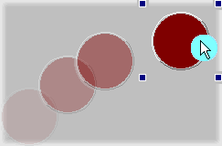
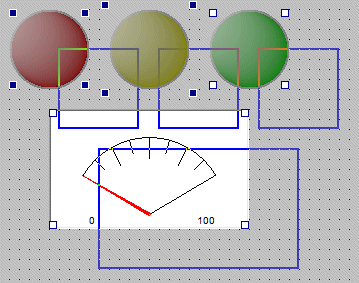

# Graphical Panels: Move a Tool

### Move a Tool

To move a tool, simply click inside it with the mouse to select it; you will see square "handles" appear at its corners. Next, click in the middle of the tool, and with the mouse button held down, drag the tool, releasing the button where you want the tool to be located (Figure 1).

The coordinates of the tool will update in the Properties Tab after the mouse button is released. This also works in the other direction: you can move the tool by changing the **Top** and **Left** attributes in that tab; it will move within the grid to match the new values.

### Move a Group of Tools

You can move a group of tools in a manner similar to that used for a single tool. Start by clicking and dragging a selection box around all of the tools you want to move; handles will appear at the corners of each one selected. (You can also add a tool to a a selection group by Ctrl+clicking on it.)  After choosing a set of tools, click on any tool in the group, then hold and drag the mouse to move all of the tools to a new location, maintaining their relative positions (Figure 2).

