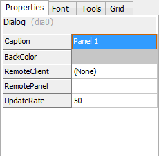

# Graphical Panels: Panel Properties

Just as tools have properties that control their appearance and behavior, so do panels themselves. These are accessed through the same side panel as tool properties, and are similar in layout and function.

To access panel properties, ensure that the panel is unlocked and the right side panel isn't hidden. Then simply click any blank area in the panel (where no tools are located). You will see four tabs: the **Font Tab**, **Tools Tab** and **Grid Tab** are identical to those shown under tool properties. The **Properties Tab** for a panel is shown in Figure 1, and its elements described in Table 1.

**Table 1: Panel Properties**

| Property     | Description                                                                                                                                                     |
| ------------ | --------------------------------------------------------------------------------------------------------------------------------------------------------------- |
| Caption      | The name of the panel. This name is shown in the list of panel tabs, and right-clicking a tab and selecting **Rename** will bring you to this property to edit. |
| BackColor    | Specifies the background color of the panel.                                                                                                                    |
| RemoteClient | Allows you to select a PC to make a connection for remote graphical panels.                                                                                     |
| RemotePanel  | The name of the remote panel to which a connection should be made.                                                                                              |
| UpdateRate   | The rate at which the remote panel should be updated.                                                                                                           |
