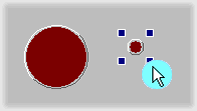

# Graphical Panels: Resize a Tool

To resize a tool, select it, then click and drag one of the four small square handles that appear in the corners (Figure 1). Changes to the dimensions will be shown in the **Width** and **Height** attributes of the Properties tab. You can also set a tool's dimensions to precise values by editing those properties directly.\
\
A group of tools can be resized to have the same dimensions using the format button.

