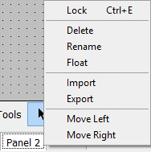

# Graphical Panels: Select and Work With Panels

There are several features to help you work with the various panels that comprise a complete Graphical Panel application. These are controlled via a set of buttons located below the main toolbar; an example can be found in Figure 1.

### Graphical Panel Controls

Table 1 illustrates and explains the function of the various panel control functions seen in Figure 1.

**Table 1: Panel Control Buttons**

| Button               | Icon                                                                                   | Description                                                                                                                                                             |
| -------------------- | -------------------------------------------------------------------------------------- | ----------------------------------------------------------------------------------------------------------------------------------------------------------------------- |
| Show/Hide Toolbar    |     | Toggles between showing and suppressing the bar containing [panel tools](graphical-panels-tools/).                                                                      |
| Show/Hide Properties |  | 
Reveals or hides the 

<a href="graphical-panels-tool-properties.md">Properties Toolbar</a> on the right side of the graphical panels screen.
               |
| Select Panel         |              | Makes the selected panel active.                                                                                                                                        |
| Move Panel Left      |            | Moves the currently-selected panel left in the panel list.                                                                                                              |
| Move Panel Right     |           | Moves the currently-selected panel right in the panel list.                                                                                                             |
| Import Panel         |              | Loads a previously-saved panel into the current graphical panel set.                                                                                                    |
| Export Panel         |              | Exports a panel to an external file.                                                                                                                                    |
| Add Graphical Panel  |                 | Adds a new Graphical Panels window to the Vehicle Spy setup. This will not create a new individual panel, but actually an entire new set of panels, for complex setups. |
| Lock/Unlock Panels   |          | [Switches the Graphical Panel between edit mode and interaction mode.](graphical-panels-lock-panels.md)                                                                 |

Most of these buttons can also be accessed by right-clicking on any of the panel tabs to bring up a context menu (Figure 2). This menu also allows you to [delete](graphical-panels-add-or-delete-panels.md), [float](floating-panels.md) or [rename](graphical-panels-panel-properties.md) a panel.

