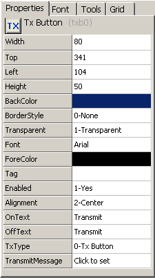

# Graphical Panels: Tool Properties

Each tool has a number of properties that define its appearance and behavior. When a tool is selected, the properties window on the right updates to show the properties relevant to that tool and their current values. This window has four tabs that allow you to easily access and modify tool settings.

### Properties Tab

This tab, shown by default, lists the name of each property associated with the seleted tool (Figure 1:). If there are too many tools to fit the window, a scroll bar will appear to allow you to navigate them.

The name of each property is listed in the left-hand column, and its current value in the column on the right. To change a property, click in the box and enter the new value using the keyboard or mouse. Some properties instead work by double-clicking them to launch dialog boxes where the relevant data can be entered or modified.

Some properties are [common to all tools](graphical-panels-tools/graphical-panel-controls-common-control-properties.md), while others vary based on tool type. A full discussion of tool properties can be found in the section on [graphical panel tools](graphical-panels-tools/).

### Font Tab

Click this tab (Figure 1:) to work with just the font-related properties of a control, such as the font family (typeface), size, color, and whether text should be shown in bold or italics. The properties on the **Font** tab duplicate those found on the **Properties** tab, but you may find them easier to work with when grouped together in one place.

Changes made on this tab will change the corresponding values on the **Properties** tab, and vice versa. Note that you may need to click on the tool to see changes made on the other tab.

### Tools Tab

This tab contains the same tool buttons found at the bottom of the graphical panel display (Figure 1:), and is provided for those who find the tools easier to access from this location.

### Grid Tab

This tab (Figure 1:) contains options and features to help you move and arrange tools within a panel. You can also enable or disable the grid, and as well as the feature that allows tools to snap to the grid for easier alignment.

