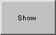

# Graphical Panel Controls: Action Button

An Action Button control provides access to the Windows file selector dialog box from within a graphical panel. This type of button is very helpful for specifying a file path for Java.

Table 1 contains descriptions of the properties specific to Action Button controls, which supplement the ones found under [Common Control Properties](graphical-panel-controls-common-control-properties.md).

**Table 1: Action Button Control Properties**

| Property | Function and Options                                                   |
| -------- | ---------------------------------------------------------------------- |
| OnText   | The text shown when the button is pressed or held down (**On** state). |
| OffText  | The text shown when the button is up (**Off** state).                  |
