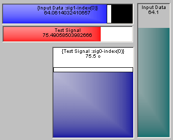

# Graphical Panel Controls: Bargraph

Bargraph controls display data using a using a simple horizontal or vertical indicator. The value of the associated signal is shown at the top of the control, while the bar graphically depicts the value by coloring in a portion of the bar between the set minimum and maximum values. A bargraph control can also be used as a slider control, which allows input by clicking and dragging the slider to a desired value. Examples of this type of control can be seen in Figure 1.

Table 1 lists the properties specific to a Bargraph control. A list of common properties for all controls can be found under [Common Control Properties](graphical-panel-controls-common-control-properties.md).

**Table 1: Bargraph Control Properties**

| Property           | Function and Options                                                                                                                                                                   |
| ------------------ | -------------------------------------------------------------------------------------------------------------------------------------------------------------------------------------- |
| BarColor           | Double-click to launch the Windows color selector to set the color of the control.                                                                                                     |
| Style              | 
Sets the bargraph's orientation:
<ul><li><strong>0-Vertical</strong></li><li><strong>1-Horizontal</strong></li></ul>                                                             |
| IsSlider           | 
Specifies whether the control is a bargraph or slider:
<ul><li><strong>0-Bargraph</strong></li><li><strong>1-Slider</strong></li></ul>                                           |
| Set integer values | 
Sets the input type when used as a slider:
<ul><li><strong>0-No:</strong> Decimal values will be set.</li><li><strong>1-Yes:</strong> Only integer values will be set.</li></ul> |
