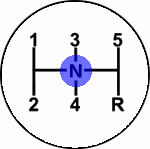

# Graphical Panel Controls: Bitmap Button

Bitmap Button controls provide two options for displaying image content within a graphical panel:

* **Single Image Display:** A single image is displayed on a button, much like an [On Off Button](graphical-panel-controls-on-off-button.md).
* **Sequential Image Display:** Several images are selected; the first is displayed by default, and the others shown based on user input. This is similar to the [Graphical Display](graphical-panel-controls-graphical-display.md) control, but instead of the display moving based on a signal value, the image shown changes when the mouse is clicked: a left-click goes forward (showing the next image in the sequence) while a right-click goes back (showing the previous image). An example can be seen in Figure 1.

Table 1 lists the properties specific to a Bitmap Button control. A list of common properties can be found under [Common Control Properties](graphical-panel-controls-common-control-properties.md).

**Table 1: Bitmap Button Control Properties**

| Property                | Function and Options                                                                                                                                                                                                                                                                                                                                                                                                                                                                                                                                                     |
| ----------------------- | ------------------------------------------------------------------------------------------------------------------------------------------------------------------------------------------------------------------------------------------------------------------------------------------------------------------------------------------------------------------------------------------------------------------------------------------------------------------------------------------------------------------------------------------------------------------------ |
| Action                  | 
Dictates how the control functions:
<ul><li><strong>0-Push Button:</strong> The control works like a push button, returning a value of <strong>False</strong> by default, or <strong>True</strong> when clicked.</li><li><strong>1-Toggle:</strong> The control changes from <strong>False</strong> to <strong>True</strong> and back again each time it is clicked.</li><li><strong>2-Switch:</strong> Each left-click increments the value, and each right-click decrements it, allowing the user to step forward or backward through a set of images.</li></ul> |
| Image                   | 
Launches a special dialog box that allows you to select one or more images for this control; an example of the interface can be found in Figure 2.  Use the <strong>+</strong> button to add an image to the control; after doing so, VSpy will show a preview of the image, along with its name, width, height, and <strong>Index Number</strong>.  Press the <strong>-</strong> button to remove an image previously selected.
                                                                                                                      |
| FirstPixelIsTransparent | 
Enables or disables transparency within the button:
<ul><li><strong>0-No:</strong> Transparency is disabled.</li><li><strong>1-Yes:</strong> Transparency is enabled, keyed on the color of the first pixel in the image. All pixels of that color are displayed as transparent.</li></ul>                                                                                                                                                                                                                                                                         |
| DisplayOnly             | 
Allows the control to be set to an output-only mode:
<ul><li><strong>0-No:</strong> Control is input/output.</li><li><strong>1-Yes:</strong> Control is display only.</li></ul>                                                                                                                                                                                                                                                                                                                                                                                    |
| Stretch                 | 
Specifies whether an image should be shown at its standard size, or stretched to fit the Bitmap Button control:
<ul><li><strong>0:</strong> Use native image size.</li><li><strong>1:</strong> Stretch image to fill control.</li></ul>                                                                                                                                                                                                                                                                                                                            |

