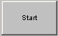

# Graphical Panel Controls: Diag Job Action Button

The Diag(nostic) Job Action Button control allows you to launch a Diagnostic Job from a graphical panel.

The properties specific to this control can be found in Table 1.  A list of common properties can be found under Common Control Properties.

**Table 1: Diag Job Action Button Control Properties**

| Property      | Function and Options                                                                                                                                                                                                                        |
| ------------- | ------------------------------------------------------------------------------------------------------------------------------------------------------------------------------------------------------------------------------------------- |
| OnText        | The text shown when the button is down (**On** state).                                                                                                                                                                                      |
| OffText       | The text shown when the button is up (**Off** state).                                                                                                                                                                                       |
| DiagJobAction | 
Determines what action is taken with respect to the selected Diagnostic Job when the button is pressed. Available options:
<ul><li><strong>0-Start</strong></li><li><strong>1-Stop</strong></li><li><strong>2-Save</strong></li></ul> |
| DiagJob       | Click to select the Diagnostic Job to act upon when the button is pressed.                                                                                                                                                                  |
