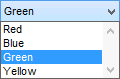

# Graphical Panel Controls: Drop Down List

A Drop Down List control allows input from a list of items. The elements of the list can be either manually entered within the control or taken from the list of name/value pairs in a state-encoded signal.

In addition to the [Common Control Properties](graphical-panel-controls-common-control-properties.md) that apply to all controls, the Drop Down List control has an additional property described in Table 1.

**Table 1: Drop Down List Control Properties**

| Property | Function and Options                                                                                                                                                                                                                                                                                                                                                                                                                                                                                                                    |
| -------- | --------------------------------------------------------------------------------------------------------------------------------------------------------------------------------------------------------------------------------------------------------------------------------------------------------------------------------------------------------------------------------------------------------------------------------------------------------------------------------------------------------------------------------------- |
| List     | Double-click this entry to bring up a dialog box where you can enter the items for the list and the values they represent (Figure 2). Simply type a name in the **List Item** box and a matching value in the **Value** box, then click the **Add** button or press Enter. Vehicle Spy will add the item to the list in the bottom of the dialog, and automatically increment the **Value** counter for the next item as a convenience. You can also click **Load From Signal** to import name/value pairs from a state-encoded signal. |

