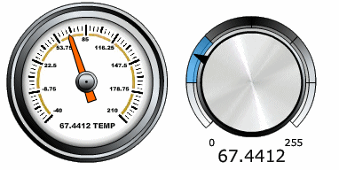

# Graphical Panel Controls: Flash Control

The Flash control allows you to embed a Shockwave Flash object to customize the look and feel of a graphical panel. Vehicle Spy ships with several Flash controls that you can use as gauges and knobs in your panel setups; these are found in the **ICS Flash Files** subfolder under the main Vehicle Spy 3 install directory. Examples of these are shown in Figure 1.

Table 1 describes the single unique property for the Flash Control. A list of additional properties can be found under Common Control Properties.

**Table 1: Flash Control Properties**

| Property | Function and Options                                                          |
| -------- | ----------------------------------------------------------------------------- |
| SWFMovie | Double-click to select a Shockwave Flash file to associate with this control. |
