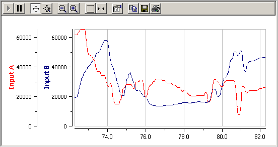

# Graphical Panel Controls: Graph

The Graph control allows you to plot the value of a group of signals over time using a line graph. Signal groups can be configured using the [Signal List](../../signal-views/signal-list.md) or [Signal Plot](../../signal-views/signal-plot.md) features.

Table 1 lists the properties specific to a Graph control. A list of common properties can be found under [Common Control Properties](graphical-panel-controls-common-control-properties.md).

**Table 1: Graph Control Properties**

| Property    | Function and Options                                                                                                                                                                                                   |
| ----------- | ---------------------------------------------------------------------------------------------------------------------------------------------------------------------------------------------------------------------- |
| SignalGroup | Double-clicking this property will launch the [Expression Editor](../../../../shared-features-in-vehicle-spy/shared-features-expression-builder.md), where you can select a signal group to be graphed.                |
| PlotSetup   | Double-click here to open a dialog box where various options to control the appearance of the graph can be configured. These are the same as the options found under [Signal Plot](../../signal-views/signal-plot.md). |
