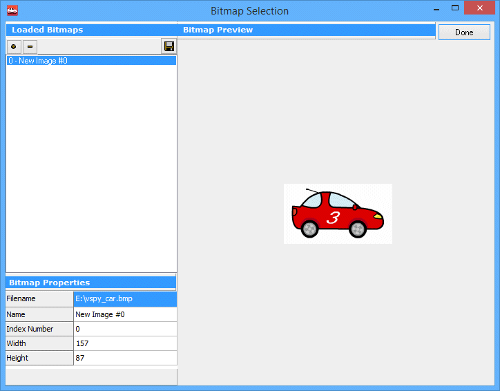

# Graphical Panel Controls: Graphical Display

Graphical Display controls provide several different ways to display images within a graphical panel:

* **Static Image Display:** Choose a single image to display within the panel (an example is shown in Figure 1).
* **Dynamic Image Display:** Select multiple images, each of which has an **Index Number** property that references it. You can then change which image is shown by linking a signal to a control, so the image displayed changes as the signal value does. This feature can also be used to create animations.
* **Group Box:** Create a graphical box to contain other panel controls.

The special properties for the Graphical Display control can be found in Table 1. A list of common properties can be found under [Common Control Properties](graphical-panel-controls-common-control-properties.md).

**Table 1: Graphical Display Control Properties**

| Property         | Function and Options                                                                                                                                                                                                                                                                                                                                                                                                                                                                                                                                                                                                                                                                                                                                                                                                                                                                        |
| ---------------- | ------------------------------------------------------------------------------------------------------------------------------------------------------------------------------------------------------------------------------------------------------------------------------------------------------------------------------------------------------------------------------------------------------------------------------------------------------------------------------------------------------------------------------------------------------------------------------------------------------------------------------------------------------------------------------------------------------------------------------------------------------------------------------------------------------------------------------------------------------------------------------------------- |
| Images           | 
Launches a special dialog box that allows you to select one or more images to show within this control; an example of the interface can be found in Figure 2.  Use the <strong>+</strong> button to add an image to the control; after doing so, VSpy will show a preview of the image, along with its name, width, height, and an integer <strong>Index Number</strong> that you can use to select the image by linking it to a signal.  Press the <strong>-</strong> button to remove an image previously selected.  <strong>Note:</strong> The image displayed by default is the one with an <strong>Index Number</strong> value of 0. If no image has that index, the Graphical Display control will appear blank until the signal linked with the control is set to a value matching one of the actual <strong>Index Number</strong> values in the image set.
 |
| Stretch          | 
Specifies whether an image should be shown at its standard size, or stretched to fit the Graphical Display control:
<ul><li><strong>0:</strong> Use native image size.</li><li><strong>1:</strong> Stretch image to fill control.</li></ul>                                                                                                                                                                                                                                                                                                                                                                                                                                                                                                                                                                                                                                           |
| TransparentColor | Double-click to select a color in the image to be shown as transparent.                                                                                                                                                                                                                                                                                                                                                                                                                                                                                                                                                                                                                                                                                                                                                                                                                     |

