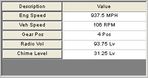

# Graphical Panel Controls: Grid

The Grid control is a quick and simple way to view multiple data elements in tabular fashion within a graphical panel (Figure 1). The data to be displayed is selected by choosing a signal group; these groups can be configured using the [Signal List](../../signal-views/signal-list.md) or [Signal Plot](../../signal-views/signal-plot.md) features of Vehicle Spy. The divider between the signal descriptions and values can be moved by clicking and dragging.

The Grid control contains the common properties found under [Common Control Properties](graphical-panel-controls-common-control-properties.md), as well as the additional properties shown in Table 1.

**Table 1: Grid Control Properties**

| Property     | Function and Options                                                                                                                                                                                                              |
| ------------ | --------------------------------------------------------------------------------------------------------------------------------------------------------------------------------------------------------------------------------- |
| Signal Group | Allows you to select a set of signals whose values will be displayed within the control.                                                                                                                                          |
| Editable     | 
Determines whether or not the values in the grid can be edited:
<ul><li><strong>0-No:</strong> Signal values cannot be edited (grid is output only).</li><li><strong>1-Yes:</strong> Signal values can be edited.</li></ul> |
