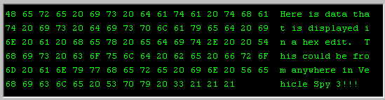

# Graphical Panel Controls: Hex Edit

The Hex Edit control allows raw data from a signal to be displayed and edited in a window within a graphical panel. An example can be seen in Figure 1.

Table 1 lists the properties specific to a Hex Edit control. A list of common properties can be found under [Common Control Properties](graphical-panel-controls-common-control-properties.md).

**Table 1: Hex Edit Control Properties**

| Property     | Function and Options                                                                                                                                                                                                                                                   |
| ------------ | ---------------------------------------------------------------------------------------------------------------------------------------------------------------------------------------------------------------------------------------------------------------------- |
| ShowAscii    | 
Controls whether or not ASCII character representations of byte values are shown in the control:
<ul><li><strong>0-No:</strong> Only the hex byte values are shown.</li><li><strong>1-Yes:</strong> Both hex bytes and ASCII characters are displayed.</li></ul> |
| BytesPerLine | Specifies the number of bytes to show in each row of the control, from 1 to 128.                                                                                                                                                                                       |
