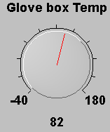

# Graphical Panel Controls: Knob

A Knob control allows data to be input using a graphical representation of a physical knob. The pointer on the knob can be clicked and dragged to a particular location in order to select a value, or the target spot can be clicked and the pointer will jump to that location.

Table 1 contains the single property specific to a Knob control.  A list of common properties can be found under Common Control Properties.

**Table 1: Knob Control Properties**

| Property           | Function and Options                                                                                                                                                                   |
| ------------------ | -------------------------------------------------------------------------------------------------------------------------------------------------------------------------------------- |
| Set Integer Values | 
Sets the input type when used as a slider:
<ul><li><strong>0-No:</strong> Decimal values will be set.</li><li><strong>1-Yes:</strong> Only integer values will be set.</li></ul> |
