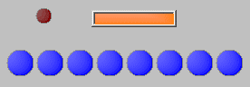

# Graphical Panel Controls: LED

LED controls can be used as indicators, and have a number of properties that allow them be used in a variety of applications; Figure 1 shows a few of the styles that can be configured.

able 1 lists the properties specific to an LED control. A list of common properties can be found under [Common Control Properties](graphical-panel-controls-common-control-properties.md).

**Table 1: LED Control Properties**

|               | Function and Options                                                                                                                                                                                                                                                                                                                                                                                                                                                                                                                                |
| ------------- | --------------------------------------------------------------------------------------------------------------------------------------------------------------------------------------------------------------------------------------------------------------------------------------------------------------------------------------------------------------------------------------------------------------------------------------------------------------------------------------------------------------------------------------------------- |
| LED On Color  | Double-click to open the standard Windows color picker, where you can select the color shown when in the **On** state.                                                                                                                                                                                                                                                                                                                                                                                                                              |
| LED Off Color | Double-click to open the standard Windows color picker, where you can select the color shown when in the **Off** state.                                                                                                                                                                                                                                                                                                                                                                                                                             |
| NumLEDs       | Sets the number of LEDs to display in the control; can be used to display LED bar graphs or binary values.                                                                                                                                                                                                                                                                                                                                                                                                                                          |
| LEDStyle      | 
Specifies the style for the LED control when the value of the <strong>NumLEDs</strong> property is greater than 1:
<ul><li><strong>0-Binary:</strong> Displays a numeric value as a binary sequence.</li><li><strong>1-Bargraph:</strong> Displays a numeric value as a bar graph.</li><li><strong>2-Cylon:</strong> Lights up the LED that matches the assigned value.</li><li><strong>3-Reverse Binary:</strong> Displays a numeric value as a binary sequence with <strong>On</strong> and <strong>Off</strong> states reversed.</li></ul> |
| Shape         | 
Specifies the shape of the control:
<ul><li><strong>0-Circle</strong></li><li><strong>1-Square</strong></li></ul>                                                                                                                                                                                                                                                                                                                                                                                                                             |
