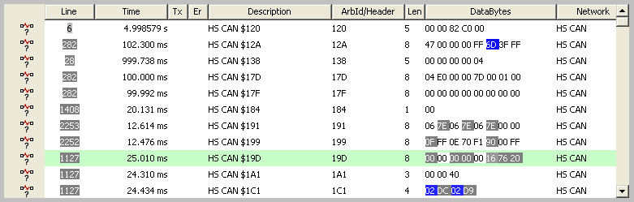

# Graphical Panel Controls: Message History

This control allows you to review the messages received by Vehicle Spy, essentially embedding a Messages View window within a graphical panel. Message filters can be applied within the control so that only messages of interest are shown.

Table 1 lists the properties specific to the Message History control.  A list of common properties can be found under Common Control Properties.

**Table 1: Message History Control Properties**

| Property     | Function and Options                                                                                                                                                                                                      |
| ------------ | ------------------------------------------------------------------------------------------------------------------------------------------------------------------------------------------------------------------------- |
| UpdateRate   | Specifies how often to update the message display, in milliseconds (default is 100 ms).                                                                                                                                   |
| Scrolling    | 
Determines whether or not messages are shown in scroll mode:
<ul><li><strong>0-No:</strong> Messages are displayed in static mode.</li><li><strong>1-Yes:</strong> Messages are displayed in scroll mode.</li></ul> |
| MonitorSetup | Launches the Setup Filter dialog box, where you can enter a filter to manage what is displayed in this control.                                                                                                           |
