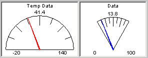

# Graphical Panel Controls: Meter

Meter controls display data using a meter face. The actual numeric value of the signal linked to the control is shown at the top, while the needle points to a representation of the current value in a manner similar to that of an automobile gauge (Figure 1). The range of displayed values is controlled through custom settings.

Table 1 lists the properties specific to the Meter control. A list of common properties can be found under [Common Control Properties](graphical-panel-controls-common-control-properties.md).

**Table 1: Meter Properties**

| Property    | Function and Options                                                                                                                                            |
| ----------- | --------------------------------------------------------------------------------------------------------------------------------------------------------------- |
| Minimum     | Sets the bottom end of the range of values that can be displayed on the meter; lower signal values will "peg" the needle at the minimum value.                  |
| Maximum     | Sets the top end of the range of values that can be displayed on the meter; higher signal values will "peg" the needle at the maximum value.                    |
| NeedleColor | Sets the color of the meter needle. Double-click to launch the Windows color picker dialog box.                                                                 |
| Angle       | Specifies the span of the meter arc in degrees, from 30 to 180. Figure 1 shows an example of a 180 degree meter on the left and a 60 degree meter on the right. |
