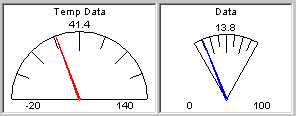
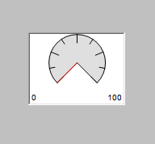
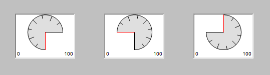
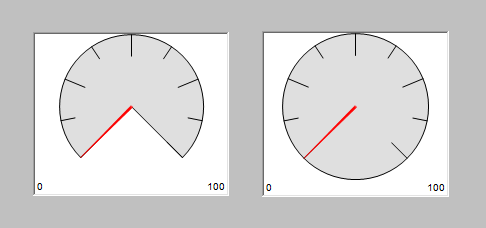
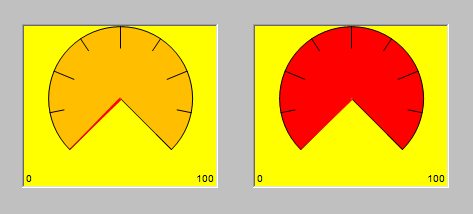
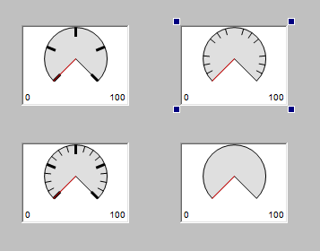
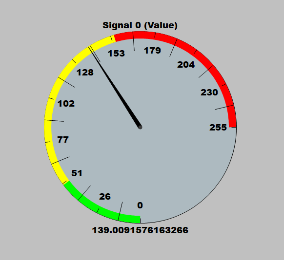

# Graphical Panel Controls: Meter

Meter controls display data using a meter face. The actual numeric value of the signal linked to the control is shown at the bottom, while the needle points to a representation of the current value in a manner similar to that of an automobile gauge (Figure 1). The range of displayed values is controlled through custom settings.

Table 1 lists the properties specific to the Meter control. A list of common properties can be found under [Common Control Properties](graphical-panel-controls-common-control-properties.md).

**Table 1: Meter-Specific Properties**

| Property   | Function and Options                                                                                                                                        |
| ---------- | ----------------------------------------------------------------------------------------------------------------------------------------------------------- |
| `Minimum`    | Sets the bottom end of the range of values that can be displayed on the meter; lower signal values will "peg" the needle at the minimum value.              |
| `Maximum`    | Sets the top end of the range of values that can be displayed on the meter; higher signal values will "peg" the needle at the maximum value.                |
| `NeedleColor` | Sets the color of the meter needle. Double-click to launch the Windows color picker dialog box.                                                            |
| `Angle`      | Specifies the total sweep span of the meter arc in degrees (30–345 when `LegacyMode` is No; 30–180 when `LegacyMode` is Yes).                                   |
| `LegacyMode` | When set to **Yes**, the meter uses the original semicircle rendering style. When set to **No**, full rendering control is enabled and the additional properties below become available. Defaults to **Yes**. |

## `LegacyMode = No` Properties

When `LegacyMode` is set to **No**, the meter uses a fully configurable rendering engine. Figure 2 shows a baseline example with default settings.

### Angle and Position

| Property   | Function and Options                                                                                                                                                                               |
| ---------- | -------------------------------------------------------------------------------------------------------------------------------------------------------------------------------------------------- |
| `StartAngle` | The angle at which the meter arc begins, in degrees. Uses the standard GDI+ convention: 0° is East (3 o'clock), increasing clockwise. Default is 210°. |

💡 **Negative `StartAngle` values are supported.** For example, -90° is equivalent to 270° (12 o'clock / North).

Figure 3 shows the effect of different `StartAngle` combinations.  From left to right, `StartAngle` is 90°, 180°, 270°.

### Appearance

| Property       | Function and Options                                                                                                              |
| -------------- | --------------------------------------------------------------------------------------------------------------------------------- |
| `ShowValue`      | When set to **Yes** (default), the current signal value is displayed as text at the bottom of the control. Set to **No** to hide it. |
| `FullCircle`     | When set to **Yes**, the meter background is drawn as a full circle instead of a pie slice. Tick marks, the needle, and start/span angles are unaffected. |
| `FaceColor`      | Sets the fill color of the meter face. Double-click to launch the Windows color picker dialog box.                                |
| `FaceColorAlpha` | Sets the transparency of the meter face fill, from 0 (fully transparent) to 255 (fully opaque).                                  |

Figure 4 shows `FullCircle = No` (left) versus `FullCircle = Yes` (right). 

Figure 5 shows the effect of `FaceColor` and `FaceColorAlpha`.  Both meters have a yellow background and a red face.  The meter on the left has `FaceColorAlpha = 64` (partially transparent), while the meter on the right has `FaceColorAlpha = 255` (completely opaque).

### Tick Marks

| Property              | Function and Options                                                                                         |
| --------------------- | ------------------------------------------------------------------------------------------------------------ |
| `MajorTicks`            | When set to **Yes** (default), major tick marks are drawn on the meter arc.                                  |
| `MajorTicksCount`       | The number of major tick marks displayed, from 2 to 20. Default is 5.                                        |
| `MajorTickLength`       | The length of major tick marks as a fraction of the meter radius, from 0.05 to 1.0. Default is 0.3.          |
| `MajorTickWidth`        | The pen width of major tick marks in pixels, from 0.5 to 10.0. Default is 1.0.                              |
| `MinorTicks`            | When set to **Yes** (default), minor tick marks are drawn between major ticks.                               |
| `MinorTicksPerInterval` | The number of minor tick marks between each pair of major ticks, from 0 to 10. Default is 1.                 |
| `MinorTickLength`       | The length of minor tick marks as a fraction of the meter radius, from 0.05 to 1.0. Default is 0.2.          |
| `MinorTickWidth`        | The pen width of minor tick marks in pixels, from 0.5 to 10.0. Default is 1.0.                              |

Figure 6 illustrates tick mark combinations: major ticks only (top left), minor ticks only (top right), both enabled (bottom left), and both disabled (bottom right).  In all cases, `MajorTickWidth = 3`, and `MinorTicksPerInterval = 3`.

### Tick Labels

| Property          | Function and Options                                                                                                                                                                              |
| ----------------- | ------------------------------------------------------------------------------------------------------------------------------------------------------------------------------------------------- |
| `TickLabels`        | When set to **Yes** (default **No**), numeric value labels are drawn at each major tick mark.|
| `TickLabelOffset`   | Adjusts the radial distance between the meter arc and the tick labels, in pixels (-200 to 200).|
| `TickLabelDecimals` | The number of decimal places shown in tick labels, from 0 to 15. Default is 3.|

💡 Positive `TickLabelOffset` values move labels outward; negative values move them inside the gauge arc. Default is 4. |

Figure 7 shows two meters each with `TickLabels = Yes`.  One has the default positive `TickLabelOffset` (outside the arc, left) and the other has a negative offset (inside the arc, right).  In both cases, `TickLabelDecimals = 0` and `FullCircle = Yes`.

### Colored Arcs

Up to three independent colored arcs can be drawn over the meter face to highlight value zones such as normal, caution, and critical ranges. 

💡 **An arc is hidden when its start and end values are equal**.

| Property       | Function and Options                                                                                                              |
| -------------- | --------------------------------------------------------------------------------------------------------------------------------- |
| `Arc1Color`      | Sets the color of the first colored range arc. Double-click to launch the Windows color picker dialog box.                        |
| `Arc1StartValue` | The value at which the first range arc begins.                                                                                    |
| `Arc1EndValue`   | The value at which the first range arc ends.                                                                                      |
| `Arc1Width`      | The width of the first range arc in pixels, from 1 to 50. Default is 10.                                                         |
| `Arc2Color`      | Sets the color of the second colored range arc.                                                                                   |
| `Arc2StartValue` | The value at which the second range arc begins.                                                                                   |
| `Arc2EndValue`   | The value at which the second range arc ends.                                                                                     |
| `Arc2Width`      | The width of the second range arc in pixels, from 1 to 50. Default is 10.                                                        |
| `Arc3Color`      | Sets the color of the third colored range arc.                                                                                    |
| `Arc3StartValue` | The value at which the third range arc begins.                                                                                    |
| `Arc3EndValue`   | The value at which the third range arc ends.                                                                                      |
| `Arc3Width`      | The width of the third range arc in pixels, from 1 to 50. Default is 10.                                                         |

Figure 8 shows a meter with all three arcs configured as green, yellow, and red zones.  This meter also has a negative `TickLabelOffset` and `FullCircle = Yes`.

