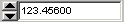

# Graphical Panel Controls: Numeric Entry

A Numeric Entry control allows you to input numeric data into a graphical panel. Values can be typed in using the keyboard and/or changed via the up and down arrows within the control. Minimum and maximum values can also be specified to restrict entry to a particular value range.

Table 1 contains the properties specific to a Numeric Entry control.  A list of common properties can be found under Common Control Properties.

**Table 1: Numeric Entry Control Properties**

| Property    | Function and Options                                                                                                                                       |
| ----------- | ---------------------------------------------------------------------------------------------------------------------------------------------------------- |
| Style       | 
Specifies the format for the control:
<ul><li><strong>Hexadecimal</strong></li><li><strong>Integer</strong></li><li><strong>Float</strong></li></ul> |
| Interval    | The amount by which the current value is incremented by the up arrow or decremented by the down arrow when either is pressed.                              |
| UpDownAlign | 
Sets the location of the up/down arrows within the control:
<ul><li><strong>0-Left</strong></li><li><strong>1-Right</strong></li></ul>               |
