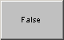

# Graphical Panel Controls: On/Off Button

An On Off button allows you to change the value of a digital (binary) signal or [application signal](../../../main-menu-scripting-and-automation/application-signals/) within a graphical panel. You can also use this control to take Vehicle Spy online or offline.

Table 1 lists the special properties associated with On Off Button controls. A list of common properties can be found in [Common Control Properties](graphical-panel-controls-common-control-properties.md).

**Table 1: On Off Button Control Properties**

| Property    | Function and Options                                                                                                                                                                                                                                                                                                                                                                                                                                                                                                                                                                                                                                                                                                                                                 |
| ----------- | -------------------------------------------------------------------------------------------------------------------------------------------------------------------------------------------------------------------------------------------------------------------------------------------------------------------------------------------------------------------------------------------------------------------------------------------------------------------------------------------------------------------------------------------------------------------------------------------------------------------------------------------------------------------------------------------------------------------------------------------------------------------- |
| OnText      | The text shown when the button is pushed or held down (**On** state).                                                                                                                                                                                                                                                                                                                                                                                                                                                                                                                                                                                                                                                                                                |
| OffText     | The text shown by default before the button is pressed (**Off** state).                                                                                                                                                                                                                                                                                                                                                                                                                                                                                                                                                                                                                                                                                              |
| OnOffType   | 
Specifies the behavior of the control:
<ul><li><strong>0-Push Button:</strong> Button state and signal value will change as long as the button is held down; releasing the button will return the button and signal to the <strong>Off</strong> state.</li><li><strong>1-Toggle Button:</strong> The button state and signal value toggle when the button is pressed.</li><li><strong>2-Online/Offline Button:</strong> The button emulates the behavior of the blue Vehicle Spy start/stop buttons (/). VSpy will be online when the button is down, and offline when it is up.</li></ul> |
| JavaProject | Sets the name of a Java project to access, when the button is tied to a Java project.                                                                                                                                                                                                                                                                                                                                                                                                                                                                                                                                                                                                                                                                                |
| StartJava   | 
Specifies when to run a Java project: 
<ul><li><strong>0-On Down Click:</strong> Run Java project when button is pressed down.</li><li><strong>1-On Down and Up Click:</strong> Run when button is clicked.</li></ul>                                                                                                                                                                                                                                                                                                                                                                                                                                                                                                                                       |
