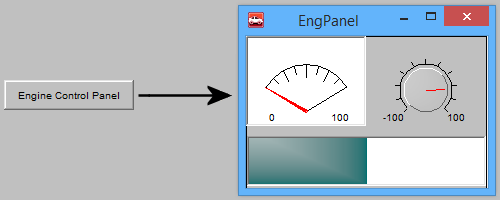

# Graphical Panel Controls: Panel Button

A Panel Button control allows one graphical panel to launch another panel under user control. This can be handy for creating complex setups with multiple panels, or for providing access to secondary controls that are only needed under certain circumstances.

Table 1 lists the properties specific to a Panel Button control.  A list of common properties can be found under Common Control Properties.

**Table 1: Panel Button Control Properties**

| Property       | Function and Options                                                                                                                                                                                                                                                                                      |
| -------------- | --------------------------------------------------------------------------------------------------------------------------------------------------------------------------------------------------------------------------------------------------------------------------------------------------------- |
| Panel          | 
Selects the name of the panel to be opened when the button is pressed.  To open multiple panels with the same button, separate their names with vertical bar ("pipe") characters ("|"). For example, to open Panel 1 and Panel 2, you would enter "Panel 1|Panel 2" here.
                    |
| CloseAllExcept | 
Allows floating panels other than the one(s) linked to the button to be automatically closed when the button is pressed:
<ul><li><strong>0-No:</strong> Other floating panels are left open.</li><li><strong>1-Yes:</strong> Other floating panels are closed when the button is pressed.</li></ul> |
