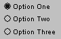

# Graphical Panel Controls: Radio Button

Radio buttons allow the user of a graphical panel to select from among a small list of available options, much like the buttons on old car stereos.\
\
These controls are usually used in groups by linking multiple radio buttons to the same signal. When one radio button tied to a particular signal is clicked, the value associated with that button is assigned to the signal. At the same time, any other radio buttons linked to that signal are de-selected, so that only one can ever be selected at a time. An example of a cluster of three radio buttons can be seen in Figure 1.

Multiple groups of radio buttons can be used to enable easy selection of options for multiple signals.

A list of common properties can be found under Common Control Properties. Table 1 describes the single additional property for the Radio Button control.

**Table 1: Radio Button Control Properties**

| Property | Function and Options                                                      |
| -------- | ------------------------------------------------------------------------- |
| Value    | Sets the value returned to the linked signal when the button is selected. |
