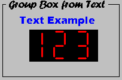

# Graphical Panel Controls: Text Display

Text Display boxes are output controls that can be configured to show static text for labeling items, or dynamic text showing signal values. Figure 1 shows examples of conventional text and group box controls (see below for more details).

Table 1 lists the properties specific to a Text Display control. A list of common properties can be found under [Common Control Properties](https://cdn.intrepidcs.net/support/VehicleSpy/gpctrlCommon.htm).

**Table 1: Text Display Control Properties**

| Property     | Function and options                                                                                                                                                                                                                                                           |
| ------------ | ------------------------------------------------------------------------------------------------------------------------------------------------------------------------------------------------------------------------------------------------------------------------------ |
| BorderStyle  | Text Display controls have an additional **BorderStyle** property value, beyond those described under Common Control Properties: **5-GroupBox**.  When selected, this specifies that the control defines a box that can be used to group other controls, as shown in Figure 1. |
| LCD Digits   | Enables LCD mode.  A value of 0 causes the control to display text in its default manner; a larger value switches the control to show numbers in a LCD type view; see "123" in Figure 1 for an example.                                                                        |
| LCD Decimals | Specifies the number of digits to show after the decimal point.                                                                                                                                                                                                                |
