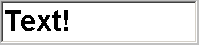

# Graphical Panel Controls: Text Entry

A Text Entry control, as the name suggests, is used to enable the input of a text string to a graphical panel. Entered text can be used to set the values of message signals or [application signals](../../../main-menu-scripting-and-automation/application-signals/).

The Text Entry control has no special properties beyond the [Common Control Properties](graphical-panel-controls-common-control-properties.md) defined for all graphical panel controls.
