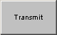

# Graphical Panel Controls: Tx Button

The Tx Button control allows you to send a transmit message from a graphical panel.

Table 1 lists the properties specific to a Tx button, which appear in addition to the common properties found under Common Control Properties.

**Table 1: Tx Button Control Properties**

| Property        | Function and Options                                                                                                                                                                                                                 |
| --------------- | ------------------------------------------------------------------------------------------------------------------------------------------------------------------------------------------------------------------------------------ |
| OnText          | The text shown when the button is pressed or held down (**On** state).                                                                                                                                                               |
| OffText         | The text shown by default, when the button is up (**Off** state).                                                                                                                                                                    |
| TxType          | 
The action that should be taken when button is pressed:
<ul><li><strong>0-Tx button:</strong> Sends the message once.</li><li><strong>1-Periodic On/Off Button:</strong> Sends the message at the set periodic rate.</li></ul> |
| TransmitMessage | Click this field to select the message to send when the button is pressed.                                                                                                                                                           |
