# Instruments

#### Overview&#x20;

Instrument control in Vehicle Spy is a feature where rack-and-stack type instruments can be controlled through function blocks.&#x20;

#### Design&#x20;

Basic design is derived from Robo Technician Software which was developed by Intrepid Control Systems in VB. Below are the features or views implemented in Vehicle Spy.&#x20;

**Instruments View: (Vehicle Spy -> Measurements -> Instruments) -> 804.xx**&#x20;

This is a Table view that enables the user to add their own instrument in the Instrument Editor (Similar to adding messages into Messages Editor).&#x20;

Currently, 804 supports Ethernet and RS232 Interface to communicate with Instrument. Here is the PC Setup to get either of them working.

**Setup to use Instrument via Ethernet Cable:**

1. Connect the Instrument to the PC (where VSPY is installed) via RJ45 Ethernet cable.
2. Switch on the Instrument, Find the IP and Port details of that Instrument from the Instrument Panel and the procedure to find it from the panel is manufacturer specific.
3. Once you have the details, Launch Vehicle Spy, Go to Tools -> Options -> Enable “Use PC Ethernet Interface” -> OK -> Restart VSPY.
4. Goto VSPY -> Measurements -> Instruments -> Click on “+” to add a new Instrument as shown in the Figure 1.Choose Ethernet as Interface.
5. Goto Logon screen -> Choose the right network interface where the Instrument is connected and go online using any ICS hardware (like VCAN3,FIRE,FIRE2,RADGALAXY,VCAN4’s,etc.,). Please note that hardware is being used here only for licensing purpose but not for any Instrument communication at this point.
6. Once online, goto Spy Networks -> TCP/IP. Make sure the connection is established with the Instrument IP Address. You will also see the error in VSPY after few minutes of connection establishment failure.
7. If connection state is established, goto Instruments View and click on Test Connection button as shown in the Figure 1.
8. If the setup is fine, Instrument name should be seen from the Instrument as a response. Else, there will be a error dialog displaying the connection failure as shown in the Figure 2.&#x20;

**Figure 1: Instruments Editor in Vehicle Spy (VSPY -> Measurement -> Instruments)**&#x20;

* Key - Automatic entry on adding new row
* Instrument Name - Instrument Name or Manufacturer name
* Interface - RS232/Ethernet
* IP Address - IP Address for Ethernet interface, GPIB address for GPIB
* Port - Port number for RS232 or TCP&#x20;
* Test Connection - Button to implicit connectivity test and if it is successful, Instrument name will be displayed to the user. Otherwise, Connection error will be displayed

<figure>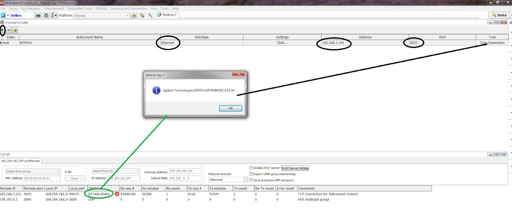<figcaption>
Figure 1: Configuring Ethernet Instruments from Vehicle Spy - Connection success
</figcaption></figure>

<figure>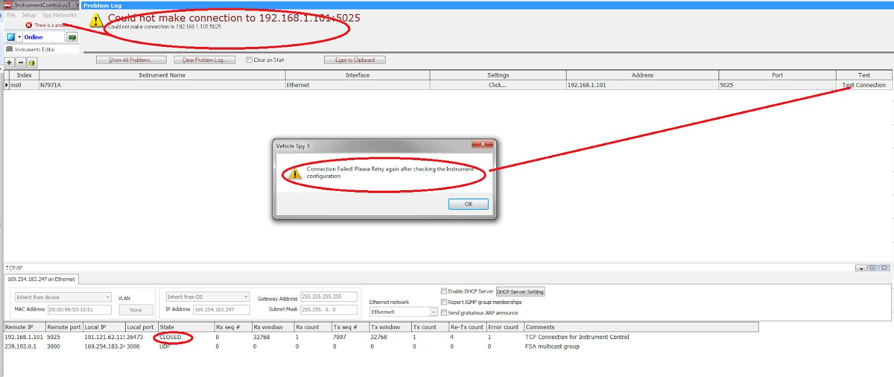<figcaption>
Figure 2: Configuring Ethernet Instruments from Vehicle Spy - Connection Failure
</figcaption></figure>

**Messages View: (Vehicle Spy -> Spy Networks -> Messages) -> 804.xx**&#x20;

For Ethernet based Instruments, we can view the Commands/Responses in Messages View as shown in the below Figure 3.

<figure>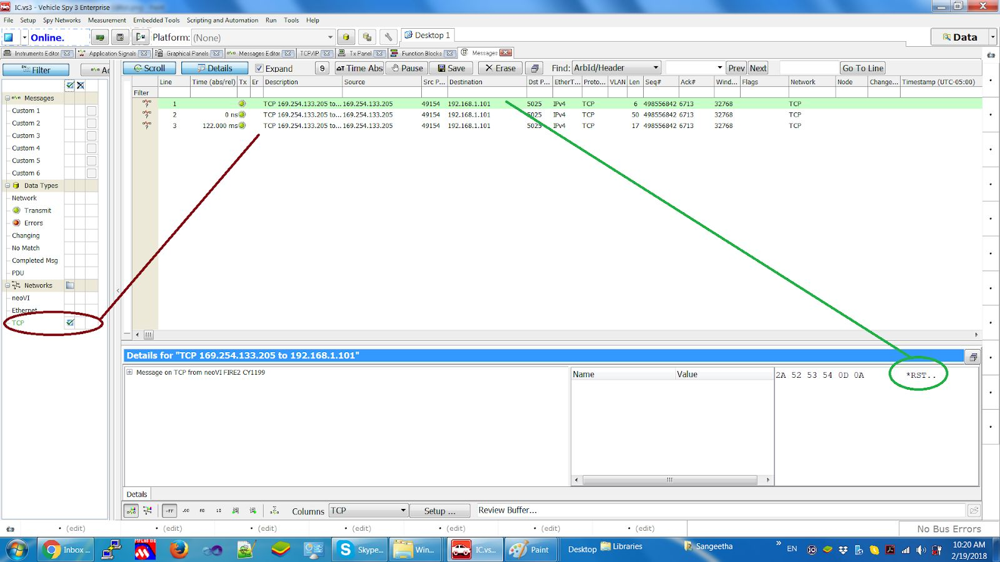<figcaption>
Figure 3: Messages View displaying the commands sent to the Instrument
</figcaption></figure>

**Setup to use Instrument via Serial Cable:** (USB to RS232 converter)

1. Connect the Instrument to the PC (where VSPY is installed) where the USB side is attached to PC USB port and RS232 side is connected to the Instrument.
2. Switch on the Instrument, Check in Device Manager to see the COM Port corresponding to the Instrument. For example COM44 (44 is the port number to be used in Vehicle Spy)
3. Once you have the port details, Launch Vehicle Spy, Goto VSPY -> Measurements -> Instruments -> Click on “+” to add a new Instrument as shown in the Figure 4. Choose RS232 as Interface.
4. Go online using any ICS hardware (like VCAN3,FIRE,FIRE2,RADGALAXY,VCAN4’s,etc.,). Please note that hardware is being used here only for licensing purpose but not for any Instrument communication at this point.
5. Once online, click on Test Connection button as shown in the Figure 4.
6. If the setup is fine, Instrument name should be seen from the Instrument as a response. Else, there will be a error dialog displaying the connection failure as shown in the Figure 5.

<figure>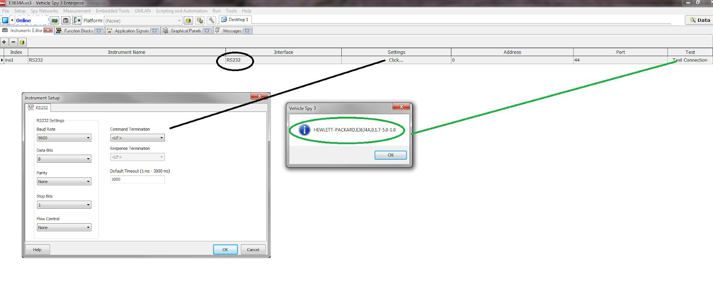<figcaption>
Figure 4: RS232 Instrument setup - Connection success
</figcaption></figure>

<figure>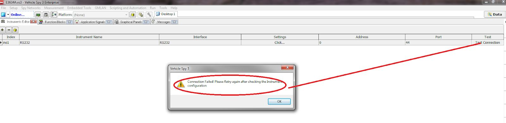<figcaption>
Figure 5: RS232 Instrument setup - Connection Failure
</figcaption></figure>

**Function Blocks View: (Vehicle Spy -> Scripting and Automation -> Function Blocks) -> 804.xx**

New Step Command called “Instrument Action” will be created in order to send commands to the instrument.

1. Option available to manually enter the commands for simple tests. Refer Figure 6 below.
2. Option to use to choose the commands from Instrument DB for complex tests . Refer the “Instrument Database” section of this document.

<figure>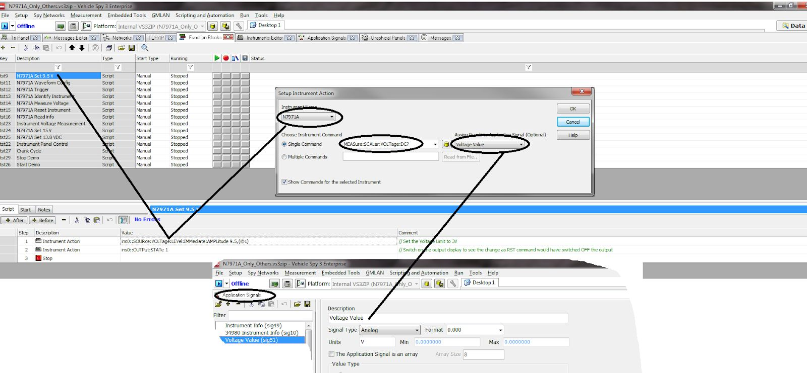<figcaption>
Figure 6: “Instrument Action” FB command in Vehicle Spy
</figcaption></figure>

**Setup Instrument Action FB Command:**

<figure>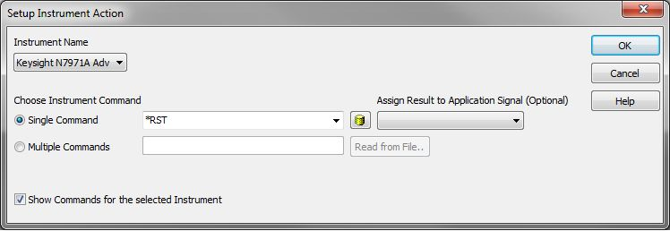<figcaption>
Figure 7: Setup Function Block for Instrument Action
</figcaption></figure>

**Instrument Name**&#x20;

&#x20;               This will be listed from the Instrument Editor and available for users to just select their Instrument in this view.&#x20;

**Enter Command/Filename**

&#x20;          ❖ Single Command: - Manually Type the exact command in the text box / Choose commands from Instrument DB.&#x20;

&#x20;          ❖ Multiple Commands  - User can import a text file which has list of SCPI Commands in it&#x20;

**Assign Result to Application Signal in case of Single command (Optional - Leave it blank if the command has no response)**&#x20;

&#x20;          ❖ If the command is going to have a response from instrument, then User can choose to store the result in the Application signal which can then be displayed in Graphical Panels. This option is available only for Single Command case.

**Add Step**&#x20;

&#x20;         ❖ Clicking this button will add the command to the Function block with all the user provided details.&#x20;

_Note: User can use Instrument Database while choosing Single Command option. This will enable one to just choose the command from database instead of typing it in the FB Window. Please refer “Instrument Database” section of this document_

**Multiple Commands - Usage Instructions:**&#x20;

This option is especially useful if one has list of commands to be executed either as an init sequence or Waveform Configuration or Waveform Trigger operation. This helps the user to have these list of commands to be reused between multiple Vehicle Spy setups.

<figure>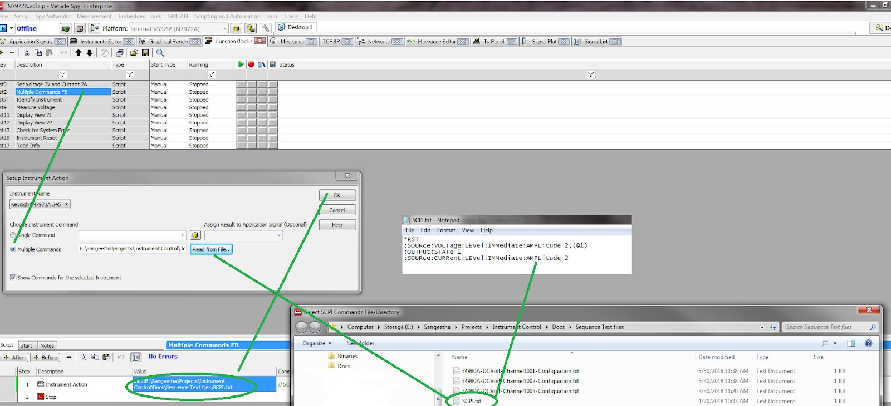<figcaption>
Figure 8: Multiple Commands Usage
</figcaption></figure>

**Instrument Database: -> 804.xx**

1. Add the command details in to the database by invoking the database from Measurement -> Instruments -> Instrument Database

<figure>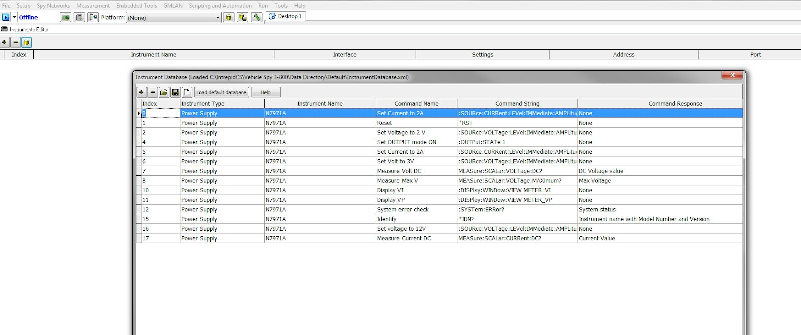<figcaption>
Figure 9: Instrument Database
</figcaption></figure>

**Fields and its explanation: (with Example command)**&#x20;

**Index** – Read only auto generated index

**Instrument type:** For example, power supply&#x20;

**Instrument Name:** For example, N7971A => Instrument name should match the one in Instruments editor&#x20;

**Command name:** Identify instrument&#x20;

**Command String:** \*IDN?&#x20;

**Command response:** Instrument name with model number&#x20;

This DB will be created/Saved as XML file and by default it will be opened/stored from/to Default data directory. There is an option “Load default database” which will be provided by Intrepid for all the users which will have basic commands that is supposed to work with all kinds of SCPI instruments. User can use this as “model” to add more commands to his DB. There is an option to Import DB, Add Entries, Delete Entries and then Export DB.&#x20;

Note: When you write FB Scripts for instrument control, FB Step command has an option to choose the instrument (instrument name), Once User chooses the instrument name, existing commands for that instrument will be fetched from the currently loaded DB which matches that instrument name.&#x20;

Note: When you open VSPY for first time, no DB exists. However, you can load the default one by clicking “Load default database” before start writing the FB Scripts. You can edit or add to the default database and export it to a different name.&#x20;

VS3 will remember the currently used DB when you open it next time.

VS3ZIP will include the DB file as part of the package and use it whenever opened next time.

FB window single command will list all the commands for the current instrument name from the loaded database.

<figure>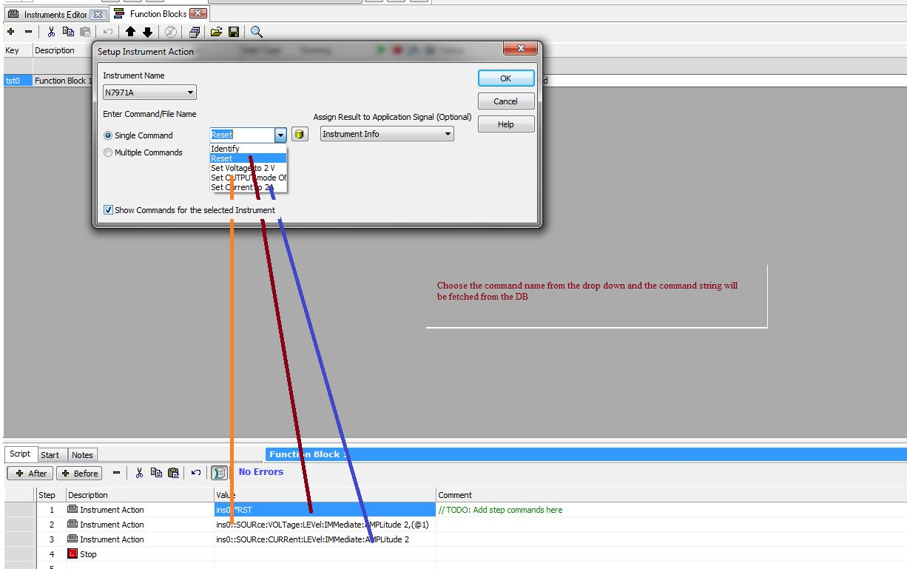<figcaption>
Figure 10: Choosing commands from Instrument Database
</figcaption></figure>

“N7971A” is the instrument name in Instruments Editor as well as in the Instrument database.

Hence, in FB Script, when user chooses the Instrument as “N7971A” , Commands will be loaded from DB for that instrument. These are going to be command names. When user selects it, Command string corresponding to that Command name will be used in the FB Step command.&#x20;

User can opt to see all the commands in the Database irrespective of the instrument name by Unchecking the check box “Show commands for the selected Instrument”

**Instrument Settings:-> 804.xx**

RS232 Instrument Settings:

<figure>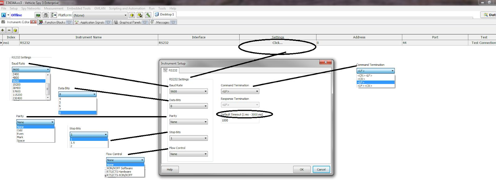<figcaption>
Figure 11: RS232 Instrument settings
</figcaption></figure>

* Baud rate/Data Bits/Parity/Stop Bits/Flow Control : These are the instrument settings which can be changed in the Instrument Panel and VSPY. <mark style="color:red;">Flow control settings are not supported yet</mark>.&#x20;
* Command Termination: Most of the RS232 Instruments needs the commands to be terminated with . This can be set to a different value as per the Instrument requirement.
* <mark style="color:red;">Response Termination: Not supported yet.</mark> If Instrument allows this to be controlled from the Instrument Panel, then it will be supported.
* Default timeout: Timeout Value in ms to wait for Instrument response

Ethernet Instrument Settings:

<figure>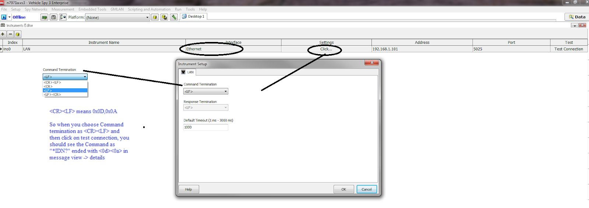<figcaption>
Figure 12: Ethernet Instrument settings
</figcaption></figure>

* Command Termination: Most of the Ethernet Instruments needs the commands to be terminated with or . This can be set to a different value as per the Instrument requirement.
* <mark style="color:red;">Response Termination: Not supported yet.</mark> If Instrument allows this to be controlled from the Instrument Panel, then it will be supported.
* Default timeout: Timeout Value in ms to wait for Instrument response
