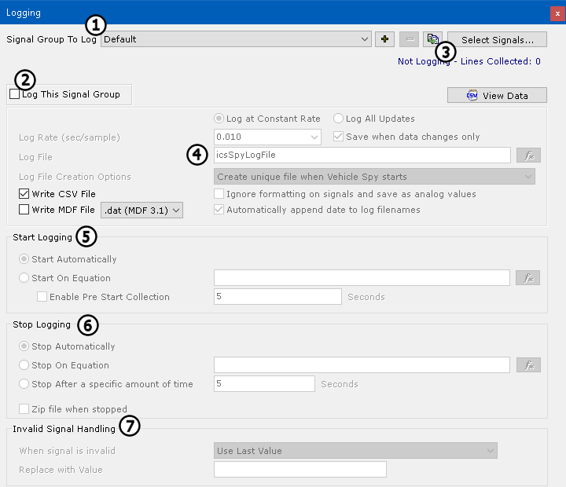

# Logging

Logging allows signal data to be saved without message data bytes and IDs. The Logging screen (Figure 1) is accessed from the **Measurement** menu.

### Selecting a Signal Group

Logging uses the same signal groups as the Signal Plot and Signal List features (Figure 1:). Start by choosing the desired signal group via the **Signal Group to Log** drop-down list. To change the signals in that group, click on **Select Signals**. The  and  buttons can be used to add and remove signal groups.

You can also press the **Copy Selected Group** button () to duplicate the currently-selected signal group.

### Enabling Logging

Enable the Logging feature for the selected signal group by clicking the checkmark next to **Log This Signal Group** (Figure 1:). This will activate most of the other controls in the window.

### Logging Status and Data

While Logging is active, its status is shown in the upper right corner (Figure 1:). You can view data as it is being collected by pressing the **View Data** button.

### Logging Setup

This option area sets primary parameters for logging (Figure 1:). These are the options found in this area:

* **Log at Constant Rate / Log All Updates:** Determines whether all data is logged or it is instead time-sampled. Choosing **Log All Updates** will disable the **Log Rate** options below.
* **Log Rate (sec/sample):** The frequency at which data is sampled and logged.
* **Save when data changes only:** When enabled, new entries are created only when data changes; this can help reduce storage requirements.
* **Log File:** The name of the file where data is to be stored.
* **Log File Creation Options:** Specifies when to reuse existing log files or start new ones, and under what circumstances.
* **Ignore formatting on signals and save as analog values:** When checked, analog values are saved without the specified formatting setup for the signal.
* **Write CSV File / Write MDF File:** The file format for saving data; at least one must be checked.

### Start Logging

The parameters in this area (Figure 1:) dictate when Vehicle Spy begins logging data. The two options are:

* **Start Automatically:** Logging begins immediately when Vehicle Spy starts.
* **Start on Equation:** Vehicle Spy begins logging when the defined condition evaluates as **True**. Selecting this option enables the equation button (), which you can click to select the start condition using the Expression Builder.

The **Enable Pre Start Collection** option allows the capture of a number of seconds of data immediately preceding the start trigger.

### Stop Logging

Choose an option in this box (Figure 1:) to tell Vehicle Spy when logging should stop:

* **Stop Automatically:** Logging stops when Vehicle Spy does.
* **Stop on Equation:** Vehicle Spy stops logging when the defined condition evaluates as **True**. As with the start condition, you can click  to specify the stop condition.
* **Stop After a specific amount of time:** Logging stops after a specified number of seconds.

The **Zip file when stopped** option tells VSpy to compress the logged data in a zip file to save space.

### Invalid Signal Handling

An invalid signal can occur when signal data is cleared in a function block, or when Vehicle Spy starts before signal data is available. The program offers several options to deal with such conditions (Figure 1:): use the last value, leave the value blank, or replace the invalid value with one specified in the **Replace with Value** field. This last option is handy if other programs are going to chart or graph this data; blank or text entries can be replaced with a value that is still able to be graphed, but is known to be invalid, so it is not confused with valid data.
