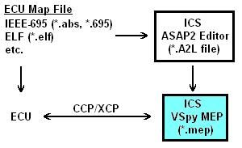

# MEP (XCP/CCP) - Memory Edit Protocol

Vehicle Spy Memory Edit Protocol (MEP) works with ECUs that use CAN Calibration Protocol (CCP) or Universal Calibration Protocol (XCP) for calibration development. MEP features are found in the Measurement -> MEP menu as shown in Figure 1.

**Table 1: Vehicle Spy MEP Menu**

| MEP Menu Selection | Description                                                     |
| ------------------ | --------------------------------------------------------------- |
| Setup              | Opens setup dialog to work with A2L files and CCP/XCP settings. |
| Value Editor       | Opens dialog to view and edit calibration values.               |
| Curve Editor       | Opens dialog to view and edit calibration curves.               |
| Map Editor         | Opens dialog to view and edit calibration maps.                 |

### Overview

With Vehicle Spy MEP you can:

* View and edit measurement and calibration items from A2L files.
* Upload calibrations from or download calibrations to an ECU using CCP/XCP.
* Perform data acquisition using CCP/XCP.
* Import/Export calibrations from/to a file.
* View setup of event based data acquisition.
* Unlock secured DAQ or calibration areas using Security DLL files.

As shown in Figure 2, Vehicle Spy MEP requires an A2L file to translate the CCP/XCP message traffic with the ECU into user friendly displays and dialogs. The A2L file links an ECU memory map to measurements, calibrations, and diagnostic information. An A2L file that follows ASAM specifications can be created with the ICS ASAP2 Editor and a standard format object file that defines the ECU's memory map.

Acronyms from specifications related to Vehicle Spy MEP can be confusing, so here's a short list to help understand them:

* A2L - ASAM MCD-2MC language used in an ECU's A2L file.
* ASAM - Association for Standardization of Automation and Measuring Systems (www.asam.net)
* ASAP2 - from German "Arbeitskreis zur Standardisierung von Applikationssystemen". Old acronym now renamed to ASAM MCD-2MC.
* CCP - CAN Calibration Protocol
* DAQ - Data Acquisition
* MCD - Measurement, Calibration, and Diagnostics
* MEP - Memory Edit Protocol
* ODT - Object Descriptor Table
* XCP - Universal Calibration Protocol
