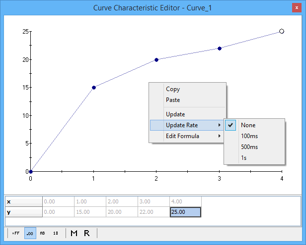

# MEP Curve Editor

Use the MEP Curve Editor (Figure 1) to view and edit calibration curves from ECUs that support CCP/XCP. Open the Curve Editor with the Measurement --> MEP menu or by double clicking on curve items in the A2L file data item tree on the [MEP Setup](mep-setup/) view.

One curve item is displayed in each instance of the editor window. The A2L file defines a curve as a one dimensional array with an x-axis. The editor displays the curve item using a two row data table and an x-y plot of that data.

The one dimensional array (y-axis) in the table can always be edited. The x-axis data may or may not have edit capability depending upon how the x-axis is defined in the A2L file. The x-axis can be a simple read-only array of element numbers as shown in Figure 1. The x-axis can also be a complex array of data with read-write capability just like the y-axis. There are many ways to change and edit the data in the table, but they generally fall into two categories: Manual and Automatic.

**Manual Methods to Change Curve Data** (in MEP, not in the ECU)

* Direct Edit - simply double click the cell and type in the desired value.
* Update - uploads curve data from the ECU. Right click and select "Update".
* "Force Upload from ECU" button - uploads all data from the ECU. Just click this button on the MEP Setup, [Properties](mep-setup/mep-setup-properties.md) tab.

**Automatic Methods to Change Curve Data** (in MEP, not in the ECU)

* Upload Memory on Characteristic Open - uploads curve data from the ECU after the curve item is opened in the editor. Enable this feature on the MEP Setup, [Properties](mep-setup/mep-setup-properties.md) tab.
* On Start Memory Load, Upload from ECU - uploads all data from the ECU everytime Vehicle Spy goes online in MEP mode. Enable this feature on the MEP Setup, [Properties](mep-setup/mep-setup-properties.md) tab.
* Update Rate - uploads data from the ECU at a periodic rate. Right click then select "Update Rate" and the desired rate.

To change a curve in the ECU to the curve shown in the editor, click the "Force Download to ECU" button on the MEP Setup, [Properties](https://cdn.intrepidcs.net/support/VehicleSpy/spyMEPSetupProperties.htm) tab.

### Data Display Modes

The buttons along the bottom of the Curve Editor change how the data in the table is displayed. Use the hexadecimal, decimal, ASCII, and binary modes to see the table data in those formats with all A2L file conversion methods applied. Use the Raw Memory (hex) and Raw Value (decimal) selections to see the table data BEFORE any A2L file conversion methods are applied.
