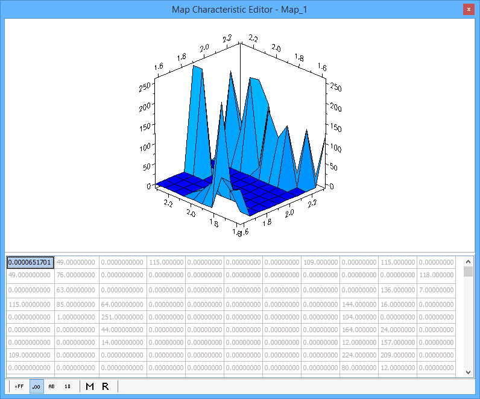

# MEP Map Editor

Use the MEP Map Editor (Figure 1) to view and edit calibration maps from ECUs that support CCP/XCP. Open the Map Editor with the Measurement --> MEP menu or by double clicking on map items in the A2L file data item tree on the [MEP Setup](mep-setup/) view.

One map item is displayed in each instance of the editor window. The A2L file defines a map as a two dimensional array with x and y axes. The editor displays the map item using a simple data table.

The two dimensional array data can always be edited. The cells for the x and y axes themselves may or may not have edit capability depending upon how they are defined in the A2L file. The axes can be simple read-only arrays of element numbers as shown in Figure 1. The axes can also be complex arrays of data with read-write capability just like the two dimensional array. There are many ways to change and edit the data in the table, but they generally fall into two categories: Manual and Automatic.

**Manual Methods to Change Map Data** (in MEP, not in the ECU)

* Direct Edit - simply double click the cell and type in the desired value.
* Update - uploads map data from the ECU. Right click and select "Update".
* "Force Upload from ECU" button - uploads all data from the ECU. Just click this button on the MEP Setup, [Properties](mep-setup/mep-setup-properties.md) tab.

**Automatic Methods to Change Map Data** (in MEP, not in the ECU)

* Upload Memory on Characteristic Open - uploads map data from the ECU after the map item is opened in the editor. Enable this feature on the MEP Setup, [Properties](mep-setup/mep-setup-properties.md) tab.
* On Start Memory Load, Upload from ECU - uploads all data from the ECU every time Vehicle Spy goes online in MEP mode. Enable this feature on the MEP Setup, [Properties](mep-setup/mep-setup-properties.md) tab.
* Update Rate - uploads data from the ECU at a periodic rate. Right click then select "Update Rate" and the desired rate.

To change a map in the ECU to the map shown in the editor, click the "Force Download to ECU" button on the MEP Setup, [Properties](mep-setup/mep-setup-properties.md) tab.

### Data Display Modes

The buttons along the bottom of the Map Editor change how the data is displayed. Use the hexadecimal, decimal, ASCII, and binary modes to see the data in those formats with all A2L file conversion methods applied. Use the Raw Memory (hex) and Raw Value (decimal) selections to see the data BEFORE any A2L file conversion methods are applied.
