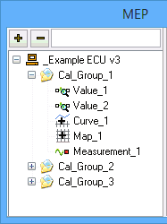
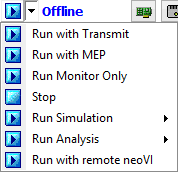
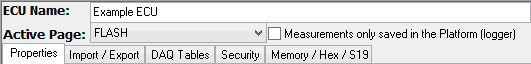

# MEP Setup

Use the Measurement --> MEP --> Setup view to:

* [View and select measurement and calibration items from A2L files.](./#a2l-file-data-item-tree-refer-to-figure-1)
* [Upload calibrations from or download calibrations to an ECU using CCP/XCP](mep-setup-properties.md#ecu-upload-download).
* [Setup data acquisition using CCP/XCP](../data-acquisition-with-ccp-xcp.md).
* [Import/Export calibrations from/to a file](mep-setup-import-export.md).
* [View setup of event based data acquisition.](mep-setup-daq-tables.md)
* [Unlock secured DAQ or calibration areas using Security DLL files.](mep-setup-security.md)

The MEP Setup view is divided into an A2L File Data Item Tree and various MEP Setup Tabs.

### **A2L File Data Item Tree** (refer to Figure 1)

The left side of MEP Setup uses a tree layout to show the calibration selections in A2L files. Click on the + and - buttons to add and delete A2L files while Vehicle Spy is offline. Use the search field next to the - button to help find specific items in large trees. Click on the +/- selectors within the tree to expand and contract the folders.

There are four types of A2L file data items:\
 Value - read/write calibration value; double click to view/edit with the [Value Editor](../mep-value-editor.md).\
 Curve - read/write calibration array; double click to view/edit with the [Curve Editor](../mep-curve-editor.md).\
 Map - read/write calibration table; double click to view/edit with the [Map Editor](../mep-map-editor.md).\
 Measurement - treated the same as Value.

If an A2L file is added:

* "Run with MEP" will become available on the Vehicle Spy mode pulldown list as shown in Figure 2. This mode has the same features as "Run with Transmit" plus support for CCP/XCP communications.
* The [Expression Builder](../../../../shared-features-in-vehicle-spy/shared-features-expression-builder.md) will have a MEP data source with all A2L file data items available.
* The [VehicleScape DAQ](../../vehiclescape-daq/vehiclescape-daq-channels-tab.md) - Channels tab will have all A2L file data items available.
* The MEP Setup Tabs area will be updated.

### **MEP Setup Tabs** (refer to Figure 3)

The right side of MEP Setup uses two data fields and a tabbed interface to setup MEP features.

The "ECU Name" is determined by the A2L file.\\

The "Active Page" determines which area of ECU memory that MEP will interact with. The selections come from any ECU calibration pages described by the A2L file. Each page is defined by a start address, block size, and memory type. Calibration pages are optional and can be implemented in different ways. Typical uses include a read-only page as a safe area for reference or backup and a read-write page as a working area for changing calibrations during development.

* [Properties](mep-setup-properties.md) - [Import / Export](mep-setup-import-export.md) - [DAQ Tables](mep-setup-daq-tables.md) - [Security Memory/Hex/S19](mep-setup-memory-hex-s19.md)

Click the hyperlinks below Figure 3 to jump to help files for each of the MEP Setup tabs.
