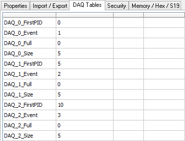

# MEP Setup - DAQ Tables

The [MEP Setup](./) DAQ Tables tab (Figure 1) displays information about [event based data acquisition](../data-acquisition-with-ccp-xcp.md) with CCP/XCP. ECUs with CCP/XCP have the option to use events and DAQ lists to organize and report their data. Event based DAQ'ing can help synchronize ECU measurements and free up its resources for other activities.

Each ECU event can trigger multiple DAQ lists.\
Each DAQ list can have multiple ODTs (Object Descriptor Tables).\
Each ODT can have multiple [A2L file data items](./#a2l-file-data-item-tree-refer-to-figure-1), also known as elements.

The DAQ Tables tab will show information after Vehicle Spy goes online in MEP mode with an ECU while VehicleScape DAQ has at least one A2L file data item assigned to an event. Refer to Table 1 to help understand the information shown in the DAQ Tables area.

**Table 1: MEP Setup DAQ Tables Items**

| DAQ Tables Item   | Description                                                          |
| ----------------- | -------------------------------------------------------------------- |
| DAQ\_#            | ECU DAQ list number. (not the VehicleScape DAQ session name)         |
| \_FirstPID        | Number assigned to the first ODT in this DAQ list.                   |
| \_Event           | Event number that this DAQ list is part of. (-1 if not assigned)     |
| \_Full            | 0 false/1 true. True if this DAQ list is full.                       |
| \_HasItems        | 0 false/1 true. True if this DAQ list has any data items.            |
| \_Size            | Maximum number of ODTs in this DAQ list.                             |
|                   |                                                                      |
| ODT\_#            | Object Descriptor Table number within this DAQ list.                 |
| \_ELM\_#          | Element number of item within this ODT.                              |
| For each element: | A2L data file item name, memory start address, memory size in bytes. |
