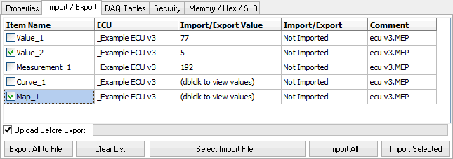

# MEP Setup - Import / Export

The MEP Setup Import / Export tab (Figure 1) uses \*.mep or \*.dcm files to import and export ECU calibration values, curves, and maps.

### Export Calibrations

To export calibrations from MEP to a file, drag and drop items from the A2L file data item tree onto the Import/Export tab, click the "Export All to File" button, and save to a file name of your choice. If "Upload Before Export" is enabled, and VSpy is online in MEP mode with the ECU, then the MEP calibration data will be updated with an upload from the ECU before being saved in the file.

### Import Calibrations

To import calibrations into MEP from a file, click the "Select Import File" button and select a file. A list of all calibrations in the file and their values will be displayed. The status field for each calibration can have the following states:

* Not Imported - value in import file has not been applied yet to item of same name in MEP.
* Applying Value - value in import file is actively being applied to MEP.
* Value Applied - value in import file has been applied to item of same name in MEP.
* NOT FOUND - item in import file does not exist in current A2L data item tree and can not be imported.

Click the "Import All" button to apply all items in the list to MEP. Or, apply only specific items by clicking their checkboxes and the "Import Selected" button.
