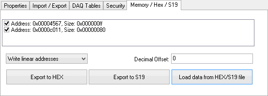

# MEP Setup - Memory / Hex / S19

The MEP Setup Memory/Hex/S19 tab (Figure 1) supports HEX (\*.hex) and S19 (\*.s) file formats to import and export ECU memory map information. Vehicle Spy must be offline to import or export the memory files.

After loading an A2L file into MEP, ECU memory addresses and block sizes will be shown with hexadecimal values. To export this memory information, click the checkboxes of the memory blocks to export, select linear or segmented addressing, and any Offset value (decimal). Once set, just click either Export button to name your file and save it in that format.

To import ECU memory map information into MEP, just click the "Load data from HEX/S19 file" button, select the file type on the file browser, and load the file.
