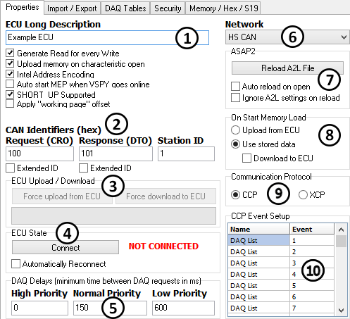

# MEP Setup - Properties

Please refer to the numbered areas in Figure 1 below as the MEP Setup Properties tab features are explained.

 **ECU Long Description & Checkboxes**: The ECU Long Description field displays the ECU description from the A2L file. The checkboxes below the description control various features:

* _Generate Read for every Write_ - read back and verify data after every calibration written to the ECU.
* _Upload memory on characteristic open_ - upload and display the latest data from the ECU when a calibration is opened for editing.
* _Intel address encoding_ - use Intel byte ordering (most significant byte last) for memory addressing.
* _Auto start MEP when VSpy goes online_ - start VSpy in "Run with MEP" mode everytime it goes online.
* _SHORT\_UP Supported_ - enable if the ECU supports the Short\_Upload command (CCP $0F or XCP $F4). This setting is typically set by the A2L file.

 **CAN Identifiers**: CAN IDs of the CCP requests transmitted by MEP and the responses received from the ECU. In some cases, a secondary Station ID is also used to properly address an ECU.

 **ECU Upload / Download**: Click the "Force upload from ECU" button to update all MEP calibration and measurements with the current data from the ECU. Click the "Force download to ECU" button to update all ECU calibrations with the current data in MEP. A status bar indicates the progress of the upload or download event.

 **ECU State**: Click the Connect/Disconnect button to start and stop the CCP/XCP link between MEP and the ECU. The current state of the CCP/XCP connection is displayed next to the button. If enabled "Automatically Reconnect" will attempt to reconnect if a disconnect is detected.

 **DAQ Delays**: These delay times are used by the High/Normal/Low priorities in standard data acquisition with CCP/XCP. Lower delay times will make measurements appear closer to "real time", but also take up more network bandwidth and ECU resources.

Please continue to refer to Figure 1 as the remaining Properties tab features are explained.

 **Network**: Determines which Network that MEP will use for the CCP link with the ECU.

 **ASAP2**: Click the "Reload A2L File" button to remap the memory address and size of all items in the A2L data item tree based upon the A2L file selected. This can save setup time if memory mapping has changed in the A2L file. If "Auto reload on open" is enabled then the A2L file is reloaded everytime the Vehicle Spy vs3 setup file is opened.

 **On Start Memory Load**: These actions (when enabled) will occur everytime Vehicle Spy goes online in MEP mode:

* _Upload from ECU_ - update MEP calibrations and measurements with data uploaded from the ECU.
* _Use stored data_ - do nothing and use whatever data is currently in MEP.
* _Download to ECU_ - update ECU calibrations with data from MEP downloaded to the ECU.

 **Communication Protocol**: Select between CCP (CAN Calibration Protocol) or XCP (Universal Calibration Protocol). Each protocol has a command set and requirements established by ASAM specifications that define the link between Vehicle Spy MEP and the ECU.

 **CCP Event Setup**: This table lists any events defined in the A2L file. CCP Events are used for event based data acquisition with CCP/XCP.

If no events are shown then you can create and edit them using the mouse right click menu. Note that events are optional though and not all ECUs support them. The number (in decimal) in the "Event" column is specific to an ECU's implementation and might not work if it is not part of the original A2L file.
