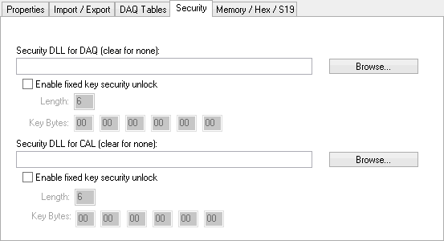

# MEP Setup - Security

The MEP Setup Security tab (Figure 1) lets you choose \*.DLL files to unlock an ECU for DAQ'ing and calibration development. Simply click the Browse button and select the \*.DLL file. Alternatively, you can also manually enter a fixed security unlock key.

