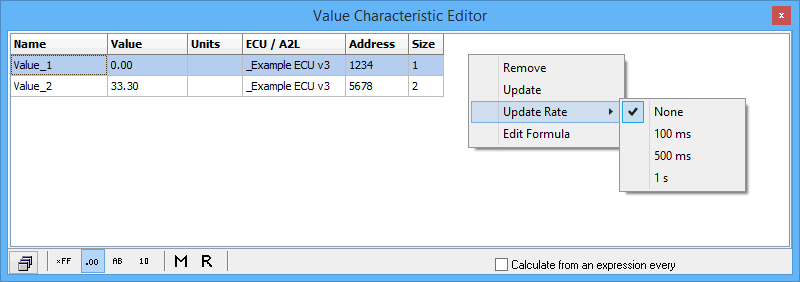

# MEP Value Editor

Use the MEP Value Editor (Figure 1) to view and edit calibration values from ECUs that support CCP/XCP. Open the Value Editor with the Measurement --> MEP menu or by double clicking on value items in the A2L file data item tree on the MEP Setup view.

In addition to double clicking, value items can be added to the editor using drag and drop. To remove a value item, left click it to highlight its row then right click and select "Remove". You can also press/hold the keyboard shift and control keys while left clicking to highlight groups of value items to be removed.

Each value item in the editor has a row with its Name, Value, ECU source, memory Address, and Size in bytes. The only data in the table that can change or be edited are the Value cells. There are many ways to change and edit the values, but they generally fall into two categories: Manual and Automatic.

### Manual Methods to Change Values (in MEP, not in the ECU)

* Direct Edit - simply double click the Value cell and type in the desired value.
* Update - uploads value from the ECU. Left click to highlight the row then right click and select "Update".
* "Force Upload from ECU" button - uploads all values from the ECU. Just click this button on the MEP Setup, Properties tab.

### Automatic Methods to Change Values (in MEP, not in the ECU)

* Upload Memory on Characteristic Open - uploads value from the ECU after the value item is added to the editor. Enable this feature on the MEP Setup, Properties tab.
* On Start Memory Load, Upload from ECU - uploads all values from the ECU everytime Vehicle Spy goes online in MEP mode. Enable this feature on the MEP Setup, Properties tab.
* Update Rate - uploads all values from the ECU at a periodic rate. Right click then select "Update Rate" and the desired rate.
* Calculate from an Expression - updates the value at a periodic rate with a calculated signal. Left click to highlight the row then enable the checkbox for this feature (bottom of Figure 1) and enter a periodic rate. Once enabled, double click the Value cell and use the Calculated Signal Editor to create the signal.

To change values in the ECU to the values shown in the editor, click the "Force Download to ECU" button on the MEP Setup, Properties tab.

### Value Display Modes

The buttons along the bottom of the Value Editor change how the values are displayed. Use the hexadecimal, decimal, ASCII, and binary modes to see the values in those formats with all A2L file conversion methods applied. Use the Raw Memory (hex) and Raw Value (decimal) selections to see the values BEFORE any A2L file conversion methods are applied.
