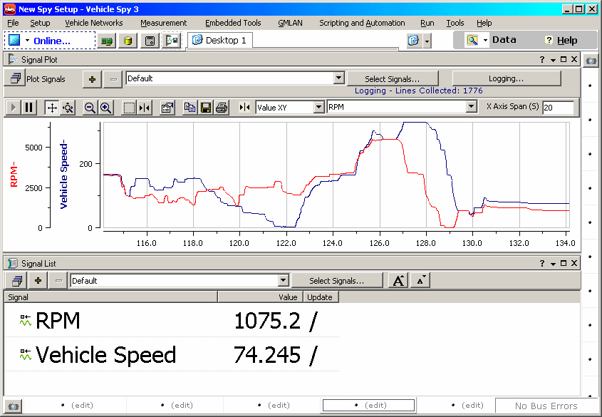

# Signal Views

[Signal Plot](signal-plot.md) and [Signal List](signal-list.md) views are two simple ways to monitor signal values. Signal Plot view has a strip-chart like graph. This graph has many different options for displaying data. Signal List view has a grid that shows the most recent value for the selected signals.

