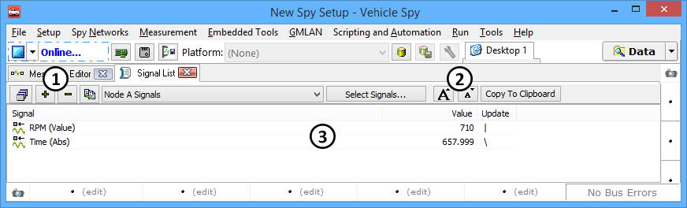

# Signal List

Use the Signal List to display Vehicle Spy signal values in real time (Figure 1).

### Signal Groups

Like the [Signal Plot](signal-plot.md), the Signal List feature works with _signal groups_, or collections of signals. New groups are created by clicking on the  button, while groups are removed by clicking the  button (Figure 1:). Signal groups are edited by clicking the **Select Signals** button and using the [Expression Builder](../../../shared-features-in-vehicle-spy/shared-features-expression-builder.md). To choose a different signal group, select it from the drop-down list to display signal values of that group in the list.

Note that the same signal groups are shared between the Signal List and [Signal Plot](signal-plot.md) features in Vehicle Spy.

### Signal List Controls

The forms button to the left of the  button will open more Signal List windows. The Signal List font size can be increased and decreased by using the font size change buttons (Figure 1:).

The main display area (Figure 1:) lists the selected signal group and the values of the associated signals. The short line in the **Update** column rotates each time the signal is updated.

Signals can be quickly removed using the right-click menu. Press/hold the keyboard shift or control keys and left-click to highlight signals, then right-click and choose **Remove Signals**.
