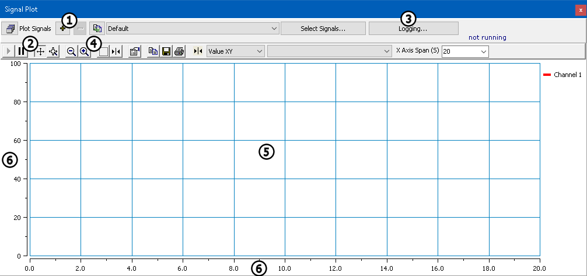

# Signal Plot

Use the **Signal Plot** (Figure 1) to plot Vehicle Spy signals in real time.

### Signal Groups

The Signal Plot feature uses _signal groups_, or collections of signals, to plot. New groups can be created by clicking on the  button, or removed using the  button (Figure 1:). Signal groups are edited by clicking the **Select Signals** button and using the Expression Builder. To choose a different signal group, select it from the drop-down list to display that group in the plot.

Note that the same signal groups are shared between the Signal Plot and Signal List features in Vehicle Spy.

### Signal Plot Controls

The **Plot Signals** button (Figure 1:) creates another Signal Plot window. The **Logging** button (Figure 1:) opens the Logging view; logging status is displayed just below the button, as shown in Figure 1.

The Signal Plot tool bar (Figure 1:) provides various features for displaying and saving data. Table 1 describes each of the Signal Plot toolbar controls. The data plot is seen in the bottom section of the window (Figure 1:). The plot axes (Figure 1:) can be stretched or zoomed by clicked and dragging them.

**Table 1: Signal Plot Toolbar Controls**

| Signal Plot Tool                                                                         | Description                                                                                                                                                                                                                                                                                                                                                  |
| ---------------------------------------------------------------------------------------- | ------------------------------------------------------------------------------------------------------------------------------------------------------------------------------------------------------------------------------------------------------------------------------------------------------------------------------------------------------------ |
|  Track           | Enabled by default, so the plot scrolls to show the most recent data; press this to resume scrolling after pressing the Pause button.                                                                                                                                                                                                                        |
|  Pause           | Stops scrolling so the display can be reviewed.                                                                                                                                                                                                                                                                                                              |
|  Scroll Axes     | When selected, dragging the mouse on an axis will scroll the axis in that direction.                                                                                                                                                                                                                                                                         |
|  Zoom Axes | When selected, dragging the mouse on an axis will zoom the axis proportionally.                                                                                                                                                                                                                                                                              |
|  Zoom Out     | Zooms out from the plot.                                                                                                                                                                                                                                                                                                                                     |
|  Zoom In       | Zooms in on the plot.                                                                                                                                                                                                                                                                                                                                        |
|  Zoom Box      | After clicking this button, left-click and drag a box around an area to zoom in, showing only what was surrounded by the box.                                                                                                                                                                                                                                |
|  Cursor          | This button enables cursors that can be dragged to make measurements from the plot.                                                                                                                                                                                                                                                                          |
|  Properties      | 
This button brings up a dialog to configure the plot.The maximum number of plot points per signal can be changed here; the default is 10,000.  Note that setting this value too high will create problems if the computer does not have enough memory. As a point of reference, 50,000 plot points with 6 signals will use about 4.8 MB of RAM.
 |
|  Copy chart      | Copies a bitmap of the plot to the Windows Clipboard so it can be pasted into another application.                                                                                                                                                                                                                                                           |
|  Save Chart      | This allow the chart to be saved as a .BMP, .PNG, .EMF, or .JPG file.                                                                                                                                                                                                                                                                                        |
|  Print Chart    | Opens a dialog to let you print the plot.                                                                                                                                                                                                                                                                                                                    |
|  Cursor Mode  | This drop-down box allows you to select what type of measurement is made with the cursors on the plot.                                                                                                                                                                                                                                                       |
|  Time Span    | This entry controls the number of seconds of data displayed on the graph.                                                                                                                                                                                                                                                                                    |
