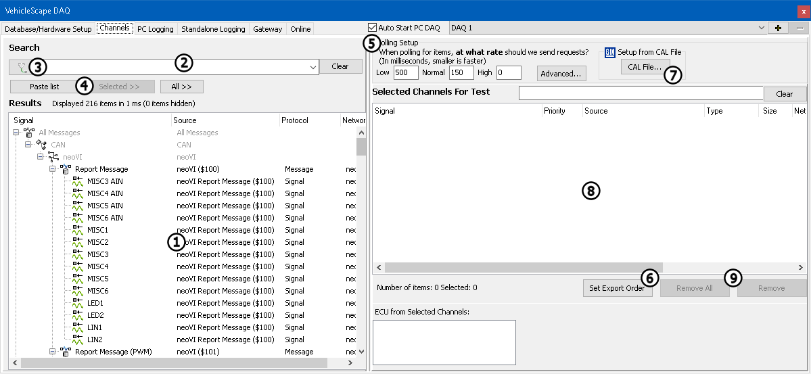
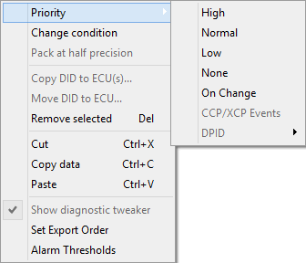

# VehicleScape DAQ: Channels Tab

The VehicleScape DAQ Channels Tab is where signals are selected to be logged. Note that the term "channel", as used in VehicleScape DAQ, is equivalent to the term "signal" used elsewhere in Vehicle Spy.

The Channels Tab is split into a left side and right side, as shown in Figure 1.

### Channels List

Use the area on the left side of the screen to search for and select signals from a list (Figure 1:). The list is a compilation of signals from various sources, including the platform, ECU diagnostics, Messages Editor, MEP A2L file data items, and application signals.

The signal list can be filtered by entering text into the search field (Figure 1:) or by clicking the diagnostics button (Figure 1:) and selecting a diagnostic category in the network/ECU tree. Multiple items can be highlighted by Ctrl+clicking individual entries or Shift+clicking to highlight a group. Then use the **Selected >>** button to select a set of highlighted signals, or **All >>** to select all signals.

The **Paste List** button (Figure 1:) can speed up signal selection when working with a huge list of signals. First, copy to the clipboard a list of line-delimited signal names from any source, such as a column in a spreadsheet. Next, click the **Paste List** button and Vehicle Spy will attempt to select all signals that match the clipboard entries. Specific problem logs will indicate any signals for which Vehicle Spy could not find a match.

### Polling Setup

Found in the upper right part of the screen (Figure 1:), polling setup rates apply only to ISO 14229 **Identifier** and **Memory Data** signals. The polling rates do **not** affect MEP A2L file data items because those items use their own MEP DAQ Delay times.

The **Set Export Order** button (Figure 1:) defines the ordering of signals in CSV and MAT signal export files. If GMLAN is enabled under OEM Specific Features, then items from GM CAL files can be loaded by clicking **CAL File...** (Figure 1:).

### Selected Channels For Test

The main area on the right side of this tab (Figure 1:) displays the signals that have been selected to be logged. If the signal is a PID or MEP A2L file data item, its priority (how often it gets requested) can be changed to high, normal or low by double-clicking on it.

Use the **Clear** button at the bottom of this area (Figure 1:) to clear the entire list, or the **Remove** button to remove signals one at a time.

NOTE: There is no undo for the Clear or Remove buttons. Copying the selection to a text editor before clearing or removing may save re-entering previous deleted signals.

### Selected Channels Right-Click Menu

Right-clicking in the **Selected Channels for Test** area will bring up a right-click context menu with a number of helpful commands (Figure 2). These options are explained in Table 1; some are also available on the Online Tab.

**Table 1: Selected Channels Right-Click Context Menu Commands and Options**

| Menu Selection          | Description                                                                                                                                                                                                                                                                                                                                                                                    |
| ----------------------- | ---------------------------------------------------------------------------------------------------------------------------------------------------------------------------------------------------------------------------------------------------------------------------------------------------------------------------------------------------------------------------------------------- |
| Priority                | Sets the priority of the message, with specific options depending on the message type. See Table 2 for details.                                                                                                                                                                                                                                                                                |
| Change condition        | 
Selects which Standalone Logging collections must be active for this signal to be requested.  <strong>Note:</strong> Valid only for ISO 14229 and GMLAN entries.
                                                                                                                                                                                                                  |
| Pack at half precision  | If an item's **Priority** is set to **Periodic**, this option packs only the signal's top half most significant bytes into a dynamic DPID. Enabling this option allows more items to be packed, at the cost of precision.                                                                                                                                                                      |
| Copy DID to ECU(s)      | Copies a DID definition from one "real" ECU to another in the diagnostic database.                                                                                                                                                                                                                                                                                                             |
| Move DID to ECU         | 
Use this command to copy DIDs from a base/virtual/GMRDB ECU with DID definitions to "real" ECUs that need DID definitions in the diagnostic database. The base/virtual/GMRDB ECU DID list will remain unchanged after using this menu selection.  <strong>Note:</strong> Allowed only for ISO 14229 DIDs with the source being a base/virtual/GMRDB ECU with USDT request ID = 0.
 |
| Remove selected         | Deletes the selected signals from the list without copying them to the clipboard.                                                                                                                                                                                                                                                                                                              |
| Cut                     | Cuts the selected signals from the list and copies their information to the clipboard.                                                                                                                                                                                                                                                                                                         |
| Copy data               | Copies all signal information to the clipboard in a tab-delimited format that can be pasted into a spreadsheet application. This feature can also take a snapshot of live data on the Online tab.                                                                                                                                                                                              |
| Paste                   | Pastes previously cut signals into the list.                                                                                                                                                                                                                                                                                                                                                   |
| Show diagnostic tweaker | Shows a viewing area on the right side of the Online tab.                                                                                                                                                                                                                                                                                                                                      |
| Set Export Order        | Sets the ordering of signals in CSV and MAT signal export files.                                                                                                                                                                                                                                                                                                                               |
| Alarm Thresholds        | Launches a dialog box that allows alarm thresholds for signals to be defined.                                                                                                                                                                                                                                                                                                                  |

**Table 2:** Priority Options for Selected Channels

| Priority Option                                | Description                                                                                                                                                                                                                                                                                                                                                                                                                                                                                                                        |
| ---------------------------------------------- | ---------------------------------------------------------------------------------------------------------------------------------------------------------------------------------------------------------------------------------------------------------------------------------------------------------------------------------------------------------------------------------------------------------------------------------------------------------------------------------------------------------------------------------- |
| High / Normal / Low                            | 
Sets the periodic rate of one shot requests sent for this item.  Polling setup defaults (ms): <strong>High = 0 / Normal = 150 / Low = 500</strong>
<ul><li>GMLAN DPID = job $AA/01</li><li>GMLAN PID = job $22</li><li>GMLAN Memory Data = job $23</li><li>ISO 14229 DID = job $22 (only if ISO15765 not needed)</li><li>ISO 14229 Memory Data = job $23</li></ul>
 MEP DAQ Delays (ms): <strong>High = 0 / Normal = 150 / Low = 600</strong>
<ul><li>MEP A2L item = MEP DAQ Delay rates</li></ul>             |
| On Change                                      |                                                                                                                                                                                                                                                                                                                                                                                                                                                                                                                                    |
| CCP/XCP Events                                 | 
Selects an ECU event schedule defined in an A2L file. This is known as event based DAQ'ing.  Allowed only for MEP A2L items.
                                                                                                                                                                                                                                                                                                                                                                                          |
| 
DPID (Periodic) Fast / Medium / Slow
 | 
Sets the periodic DPID schedule rate that this item is packed in.  Per GMW3110 specification (ms): <strong>Fast = 25 / Medium = 200 / Slow = 1000</strong>
<ul><li>GMLAN DPID = job $AA 04/03/02</li><li>GMLAN PID = job $2C + $AA 04/03/02</li><li>GMLAN Memory Data = job $2D + $2C + $AA 04/03/02</li></ul>
Per ISO 14229 specification (ms): <strong>"Vehicle-Manufacturer-Specific"</strong>
<ul><li>ISO 14229 DID = job $2C + $2A 03/02/01</li><li>ISO 14229 Memory Data = job $2C + $2A 03/02/01</li></ul> |
