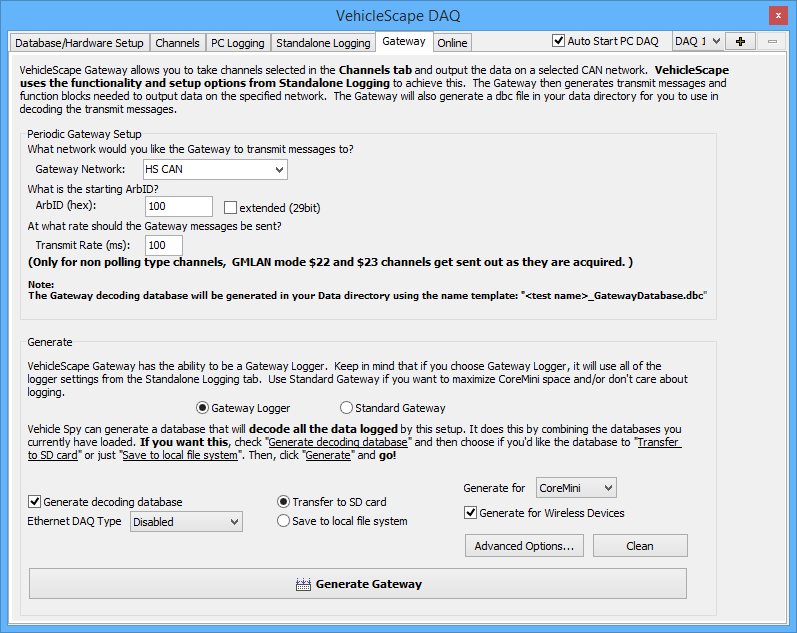

# VehicleScape DAQ: Gateway

The [VehicleScape DAQ](./) Gateway tab allows you to configure either a standard gateway or a logging gateway. Data to be gated is selected on the [Channels tab](vehiclescape-daq-channels-tab.md). VehicleScape DAQ will package the selected data into messages and transmit them on the gateway network.

The generation of the gateway is based on the functionality and setup options defined under [Standalone Logging](vehiclescape-daq-standalone-logging-tab/), which are used to generate the necessary transmit messages and function blocks. The gateway will generate a DBC file in your data directory that you can use to decode the transmit messages.

The Gateway Tab is divided into two sections, **Periodic Gateway Setup** and **Generate**, as shown in Figure 1.

### Periodic Gateway Setup

The top half of the tab is where the main gateway parameters are defined:

* **Gateway Network:** Choose the network to which you would like the gateway to transmit messages.
* **ArbID:** The starting ArbID in hex format. Check **extended (29bit)** to use extended arbitration IDs.
* **Transmit Rate:** The rate, in milliseconds, that the gateway messages should be sent. This is relevant to non-polling-type channels.

### Generate

The primary option here is the type of gateway you wish to create:

* **Gateway Logger:** Vehicle Spy will create a gateway logger using all of the logger settings defined under [Standalone Logging](vehiclescape-daq-standalone-logging-tab/).
* **Standard Gateway:** Only a gateway will be defined, without logging functions.

The remaining options and settings in this area, including those accessed through the **Advanced Options...** button, are the same as those found in the [VehicleScape DAQ Standalone Logging Generate section](vehiclescape-daq-standalone-logging-tab/standalone-logging-generation-options.md). All of these options are enabled for a gateway logger, while those relevant to logging are grayed out if a standard gateway is selected.
