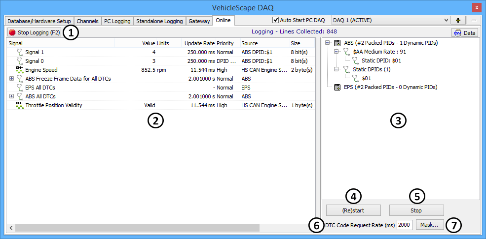

# VehicleScape DAQ: Online Tab

The Online tab is where all of the configuration work and settings in [VehicleScape DAQ](vehiclescape-daq-online-tab.md) come together for [PC Logging](vehiclescape-daq-pc-logging-tab.md). Switching from other VehicleScape DAQ tabs to this one will automatically take Vehicle Spy [online](../../main-menu-run.md). Depending on the selected settings, logging may or may not automatically commence as well.

A sample of the Online tab with logging active can be seen in Figure 1. The interface is mostly divided into a left half for signals and a right half for diagnostics. Main logging control is provided through a button at the top left, with additional controls found near the bottom right of the tab.

### Log / Stop Logging

The button at the top left of the screen (Figure 1:) allows logging to be turned on or off, changing from **Log** (with a green start icon) to **Stop Logging** (with a red stop sign) depending on current logging status. Logging can also be toggled on or off by pressing the **F2** key.

The time that logging begins depends on the setting of the **Start Logging** parameter under [PC Logging](vehiclescape-daq-pc-logging-tab.md). If it is set to **Start Automatically**, then logging will begin as soon as Vehicle Spy goes online (including when the Online Tab is clicked.) If the setting is **Start Manually**, logging must be initiated using the **Log** button; for **Start on Equation**, logging will begin when the equation evaluates to **True**.

### Signals List

The left half of the screen (Figure 1:) shows a real-time display of signals that were selected for the DAQ project under the [Channels Tab](vehiclescape-daq-channels-tab.md).

This area continues to update even while logging is disabled, making it similar to the [Signal List](../signal-views/signal-list.md) view. PID and MEP [A2L file data item](../mep-xcp-ccp-memory-edit-protocol/mep-setup/#a2l-file-data-item-tree-refer-to-figure-1) priorities can be changed to **High**, **Medium** or **Low** simply by double-clicking on them. The [right-click menu used in the Channels Tab](vehiclescape-daq-channels-tab.md) is accessible here as well, providing a number of convenient options.

### Diagnostic Tweaker

This side of the screen (Figure 1:) shows diagnostic information that VehicleScape DAQ is automatically requesting for you. The Diagnostic Tweaker window shows the diagnostic setup and results of diagnostic requests to the specific ECUs for VehicleScapeDAQ. The Tweaker is defaulted to enabled. The Tweaker window can be disabled by right clicking in the Tweaker window and unchecking the selection. To re-enable it, right click in the Tweaker window and re-check the Diagnostic Tweaker option.

### Additional Controls

Below the Diagnostic Tweaker are a few additional controls:

* **(Re)start Button:** Manually starts or restarts the entire DAQ job, including logging (Figure 1:).
* **Stop Button:** Manually stops the DAQ job, including logging (Figure 1:).
* **DTC Code Request Rate:** Specifies how often fault code requests are sent (Figure 1:).
* **Mask... Button:** Use this button (Figure 1:) to open a dialog box that will allow you to view and change DTC status mask bits (Figure 2).

