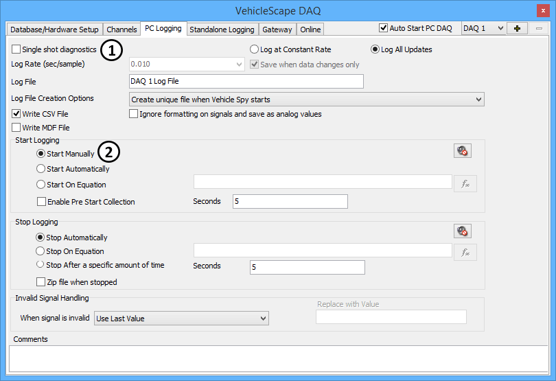

# VehicleScape DAQ: PC Logging Tab

PC Logging in [VehicleScape DAQ](./) is very similar to the [Logging](../logging.md) feature for collecting signals while connected to ICS hardware. One difference is that PC Logging provides control over the signal polling rates by using the [Channels Tab](vehiclescape-daq-channels-tab.md) or [Online Tab](vehiclescape-daq-online-tab.md). Another is that PC Logging can be controlled with a Function Block script.

The PC Logging Tab (Figure 1) determines log file parameters, when to start and stop logging, and how to handle invalid signals. The interface is almost identical to that of the [Logging](../logging.md) view, with a couple of exceptions:

* **Single shot diagnostics:** When enabled (Figure 1:), the DAQ will use GMLAN one shot (mode $AA/01) DPID requests instead of periodic (mode $AA/02-04).
* **Start Manually:** When selected, the DAQ must be started manually or by using a function block script DAQ Action command.

