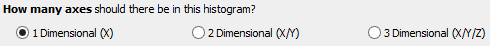
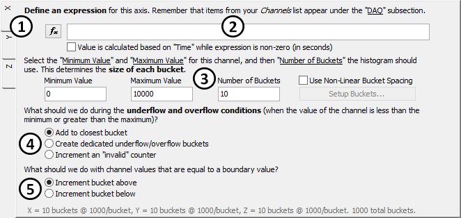
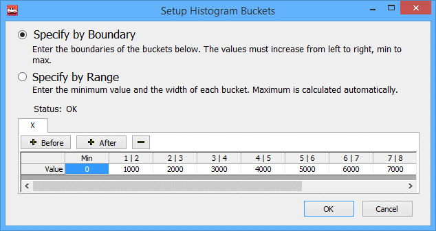
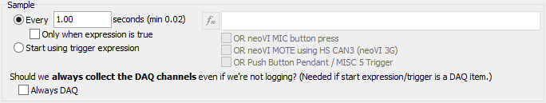
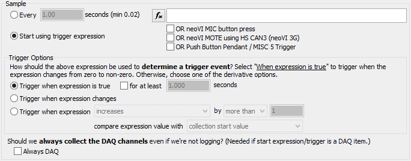

# Collections and Methods: Histogram Method

The Histogram Method of data collection in [VehicleScape DAQ](../../) [Standalone Logging](../) records the frequency of data points across a value range over a period of time. The settings in this area are broken into two main subsections, **Histogram Axis Configuration** and **Sample Options**, which are described below.

The [Status Reporting](../standalone-logging-status-reporting.md), [Power Management](../standalone-logging-power-management.md) and [Generation Options](../standalone-logging-generation-options.md) sections in the bottom half of the Standalone Logging Tab apply to all method types, including the Histogram, [Message Capture](collections-and-methods-message-capture-method/), [Bus Query](collections-and-methods-bus-query-method.md) and [Ethernet DAQ](collections-and-methods-ethernet-daq-method.md) methods.

### Histogram Axis Configuration

This is the main part of the Histogram Method view, where you define the characteristics of the histogram you want to generate.

### Histogram Dimension Selection

Begin by defining the dimensions of the histogram; that is, choosing the number of axes in the configuration. Choices are as follows (Figure 1):

* 1 Dimensional (X axis only)
* 2 Dimensional (X and Y axes)
* 3 Dimensional (X, Y and Z axes)

### Histogram Axis Expression and Options

You must choose an expression and make appropriate settings for each of the axes selected in the preceding step. This is accomplished using the main expression selection and settings area shown in Figure 2.

### Axis Tabs

Each axis has its own settings, and you can swap among them by clicking on the axis tabs found on the left side of the Histogram Axis Configuration area.

Changing the dimension of the histogram will add or remove tabs from the list; (Figure 2:) shows the tabs for a **3 Dimensional** histogram setup.

### Expression Selection

Press the  button to define an expression for the current axis using the [Expression Editor](../../../../../shared-features-in-vehicle-spy/shared-features-expression-builder.md) (Figure 2:).

Just below the expression box is a checkbox option: **Value is calculated based on "Time" while expression is non-zero (in seconds)**. When selected, this means the collection will count the length of time (in seconds) that the axis expression is non-zero. Use this to count how often an event of varying duration has occurred.

### Minimum Value / Maximum Value / Number of Buckets

The **Minimum Value** is the lowest value that will be logged for the current channel for this axis, and the **Maximum Value** is the highest figure. The **Number of Buckets** determines how many categories into which the full range of values is split to create the histogram.

For example, the default settings shown in (Figure 2:) define a histogram where the lowest possible value is 0, the highest is 10,000 and the number of buckets is 10. This means that each bucket will have a size of 1,000. Remember that these values, which are summarized at the bottom of Figure 2, are set on a per-axis basis.

By default, all buckets are the same size, split evenly across the defined value range between **Minimum Value** and **Maximum Value**. If you check **Use Non-Linear Bucket Spacing**, you can then click the **Setup Buckets...** button to bring up the **Setup Histogram Buckets** dialog box (Figure 3). Here you can set customized buckets of variable size. Choose from defining the setup based on the boundary values between adjacent buckets, or specifying each bucket's minimum value and width.

### Underflow and Overflow Handling

This selection determines how to handle values that fall outside the defined range: _underflow_ (values below the defined **Minimum Value** parameter) and _overflow_ (values above **Maximum Value**). The choices (Figure 2:) are as follows:

* **Add to closest bucket:** Values that don't fall within range of any of the defined buckets are put in the one that is closest.
* **Created dedicated underflow/overflow buckets:** Create special underflow and overflow buckets for those values.
* **Increment an "invalid" counter:** Count the number of times a value appears that doesn't fit in a defined bucket.

### Boundary Value Handling

This option specifies how to handle values that exactly equal a boundary between buckets (Figure 2:):

* **Increment bucket above:** Count the boundary value as part of the bucket above the boundary.
* **Increment bucket below:** Count the boundary value as part of the bucket below the boundary.

### Sample Options

The settings in this part of the Histogram Method setup control when and how samples for the histogram are taken. There are two basic choices:

* **Every # seconds:** Sample periodically using the specified time interval.
* **Start using trigger expression:** Sample when a trigger event occurs.

The available options change based on which of these selections is made.

### Sample Every # Seconds

The default setting is to sample periodically using the specified time interval (default is every 1 second). Figure 3 shows the settings available in this mode.

Checking the **Only when expression is true** box causes data to be logged periodically only when the specified expression is true. Press the  button to select the expression; you can also check boxes to enable any of the following events as triggers for sampling:

* neoVI MIC button press
* neoVI MOTE using HS CAN3
* Push Button Pendant / MISC 5 Trigger

### Start Using Trigger Expression

When this option is selected, the settings in this area appear as in Figure 4.

### Selecting a Trigger

Press the  button to select the expression, and optionally check boxes to enable any of the following events as triggers:

* neoVI MIC button press
* neoVI MOTE using HS CAN3
* Push Button Pendant / MISC 5 Trigger

### Determining a Trigger Event

There are three options for determining when a trigger event has occurred:

* **Trigger when expression is true:** Sample when the expression is true, optionally for a set period of time.
* **Trigger when expression changes:** Sample when the expression changes from its current value.
* **Trigger when expression increases / decreases / changes / exceeds constant and then decreases:** Sample when the selected event occurs.

### Always DAQ Option

When enabled, always request DAQ items even if they are not being logged. Requested DAQ items are diagnostic signals that get polled from ECUs like DTCs, PIDs, ISO 14229 IDs, and MEP A2L file data items. This must be enabled if the trigger is a DAQ item.
