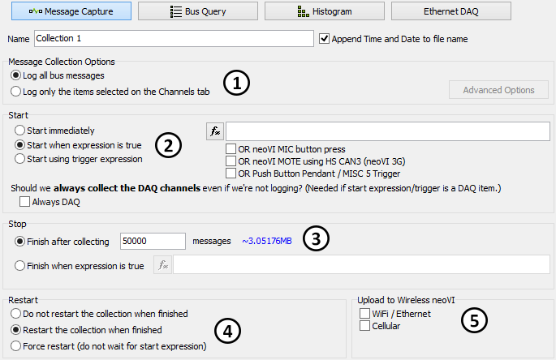

# Collections and Methods: Message Capture Method

In [VehicleScape DAQ](../../../), the [Standalone Logging](../../) of a Message Capture [collection](../) lets ICS hardware log data files over a period of time. Figure 1 shows the default settings you will see when first entering this area, though changes to some settings will alter the displayed options in other areas.

The options for this collection method are broken into five subsections:

* [Message Collection Options](message-capture-method-message-collection-options.md): Select which messages to log, and how to log them (Figure 1:).
* [Start Options](message-capture-method-start-options.md): Specify when to start logging and set options to control how it is done (Figure 1:).
* [Stop Options](../message-capture-method-stop-options/): Tailor the collection process, based in part on the Collection Start Option selected above (Figure 1:).
* [Restart Options](../message-capture-method-restart-options.md): Specify whether or not to restart when logging stops (Figure 1:).
* [Upload to Wireless neoVI](../message-capture-method-upload-to-wireless-neovi.md): Settings for data upload when using ICS hardware with wireless support (Figure 1:).

The [Status Reporting](../../standalone-logging-status-reporting.md), [Power Management](../../standalone-logging-power-management.md) and [Generation Options](../../standalone-logging-generation-options.md) sections in the bottom half of the Standalone Logging Tab apply to all method types, including the Message Capture, [Bus Query](../collections-and-methods-bus-query-method.md), [Histogram](../collections-and-methods-histogram-method.md) and [Ethernet DAQ](../collections-and-methods-ethernet-daq-method.md).
