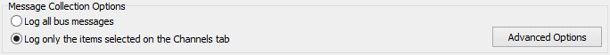
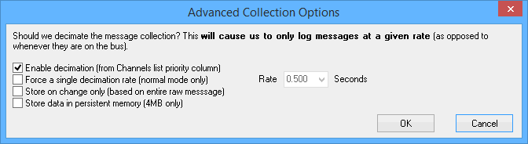

# Message Capture Method: Message Collection Options

In VehicleScape DAQ Standalone Logging, the first set of options for the Message Capture Method deals with which messages to collect. Figure 1 shows this subsection of the options tab.

There are two main options:

* **Log all bus messages:** Log all messages from all networks.
* **Log only the items selected on the Channels tab:** Log only data selected on the Channels tab.

### Advanced Collection Options

Clicking the **Log only the items selected on the Channels tab** option enables the **Advanced Options** button, which when clicked, opens up a dialog box with more specific settings, as shown in Figure 2.

