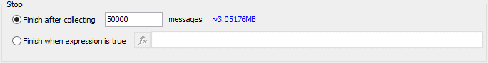

# Message Capture Method: Stop Options: Finish After Collecting Messages or When Expression is True

When using the [Message Capture](../collections-and-methods-message-capture-method/) method for [Standalone Logging](../../) within [VehicleScape DAQ](../../../), selecting **Start immediately** or **Start when expression is true** for the [Start Option](../collections-and-methods-message-capture-method/message-capture-method-start-options.md) causes the [Stop Options](./) to consist of two choices, as shown in Figure 1:

* **Finish after collecting # messages:** Stop logging when the specified number of messages has been collected after the [Start](../collections-and-methods-message-capture-method/message-capture-method-start-options.md) trigger.
* **Finish when expression is true:** Stop logging when the selected expression is true; use the  button to build the expression using the [Expression Editor](../../../../../../shared-features-in-vehicle-spy/shared-features-expression-builder.md).

